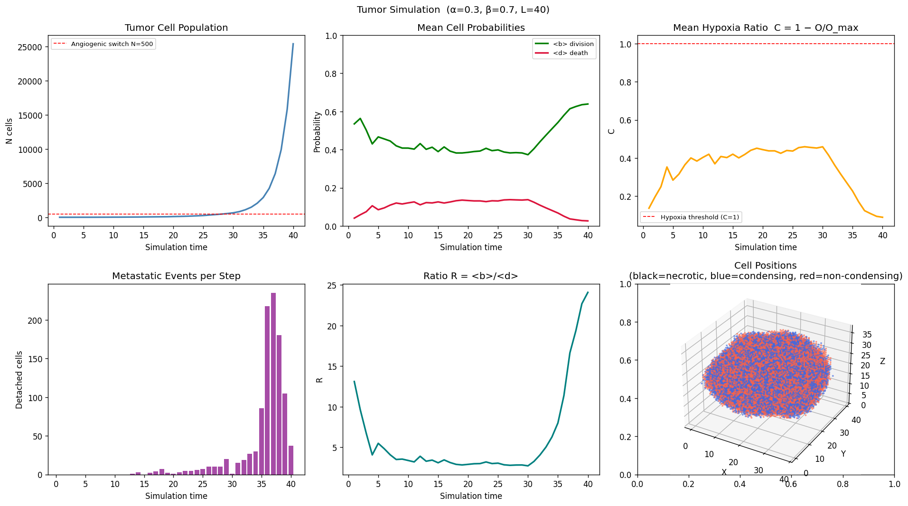
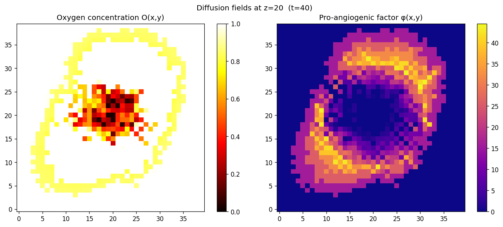
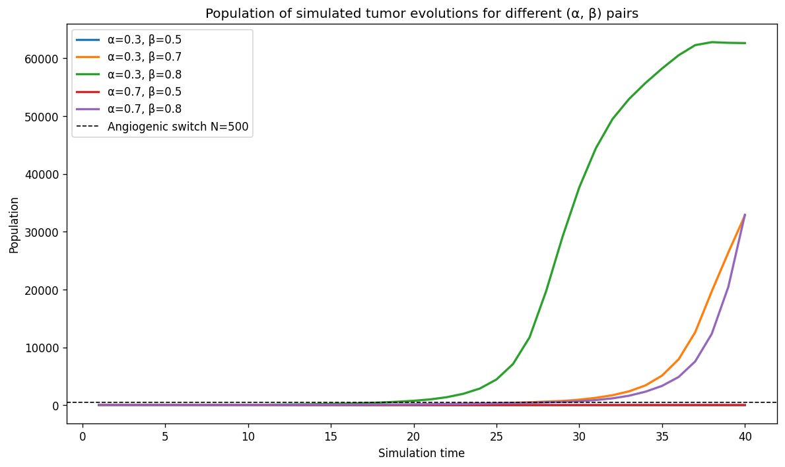
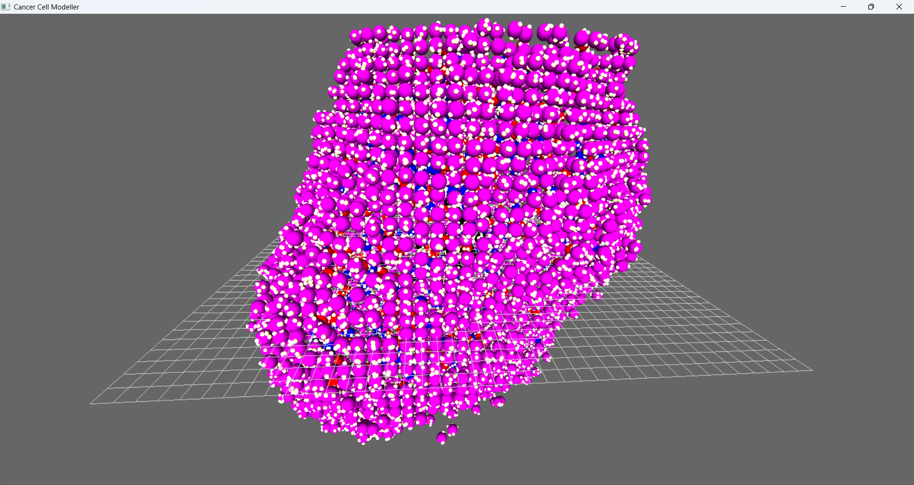
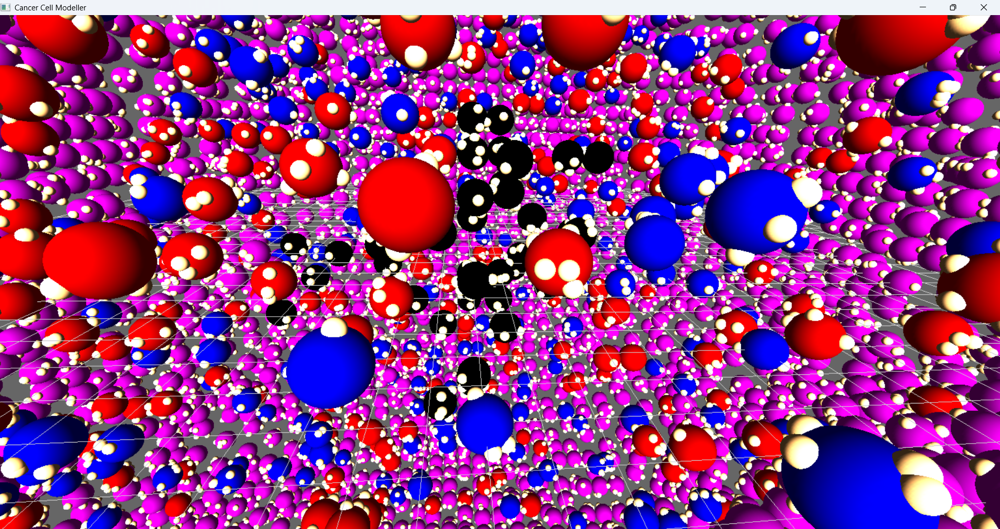

# Simulation of Cancer Cell Metastasis


This repository collects computational models developed to simulate the growth of tumors and the emergence of metastatic cells using stochastic lattice-based simulations coupled to diffusion-reaction equations.

---

## Table of Contents

1. [Project Overview](#project-overview)
2. [Description of the Model](#description-of-the-model)
    1. [Biological Motivation](#biological-motivation)
3. [Mathematical Model](#mathematical-model)
    1. [Spatial Representation](#1-spatial-representation)
    2. [Oxygen Field Dynamics](#2-oxygen-field-dynamics)
    3. [Cellular Oxygen Consumption](#3-cellular-oxygen-consumption)
    4. [Hypoxia Ratio](#4-hypoxia-ratio)
    5. [Cell Fate Probabilities](#5-cell-fate-probabilities)
    6. [Cell Phenotypes](#6-cell-phenotypes)
    7. [Angiogenic Switch](#7-angiogenic-switch)
    8. [Hypoxia and Necrosis](#8-hypoxia-and-necrosis)
    9. [Metastasis Mechanism](#9-metastasis-mechanism)
    10. [Division-Death Ratio](#10-division-death-ratio)
4. [Pareto Optimization Objectives](#pareto-optimization-objectives)
    1. [Fitness](#1-fitness-to-maximize)
    2. [Metastatic Efficiency Index (MEI)](#2-metastatic-efficiency-index-mei-to-minimize)
    3. [Necrotic Core Fraction (NCF)](#3-necrotic-core-fraction-ncf-to-minimize)
    4. [Dissipation Functional](#4-dissipation-functional-to-minimize)
    5. [Purpose of Multi-Objective Optimization](#purpose-of-multi-objective-optimization)
    6. [Biological Interpretation](#biological-interpretation)
5. [Model Assumptions and Limitations](#model-assumptions-and-limitations)
6. [Relation to Statistical Physics and Renormalization Group](#relation-to-statistical-physics-and-renormalization-group)
7. [3D Visualization Tool](#3d-visualization-tool)
8. [Project Structure](#project-structure)
9. [Installation & Usage](#installation--usage)
10. [Example Output](#example-output)
    1. [Single Simulation](#single-simulation)
    2. [Batch Parameter Sweep](#batch-parameter-sweep)
    3. [Pareto Front Analysis](#pareto-front-analysis)
11. [References](#references)
12. [Citation](#citation)
13. [License](#license)

---

## Project Overview

This code is part of a research project carried out by [Bruno Salgado](https://brunosalgado.website/) under the supervision of [Dr. Pere Masjuan](https://orcid.org/0000-0002-8276-413X) at the Institut de Física d'Altes Energies ([IFAE](https://www.ifae.es/es/)) as part of the [Master of Multidisciplinary Research in Experimental Sciences](https://www.upf.edu/web/mmres/) at Universitat Pompeu Fabra.

The goal is to understand metastatic spread as an emergent phenomenon governed by:
- Non-equilibrium statistical physics
- Reaction–diffusion dynamics
- Scaling laws and universality classes

The simulations implemented here serve as a computational testbed for validating theoretical predictions derived from field-theoretic approaches.

---

## Description of the Model

The model describes tumor growth on a **3-dimensional cubic lattice** where each lattice site may be empty or occupied by a tumor cell.

The simulation combines three key components:

1. Agent-based tumor cell dynamics
2. Continuous diffusion fields for oxygen and signaling molecules
3. Stochastic rules governing cell fate decisions

This hybrid modeling approach is common in **computational oncology**, where discrete cells interact with continuous biochemical fields.

### Biological Motivation

Tumor growth is strongly regulated by **oxygen availability**.

When tumors grow beyond the diffusion limit of oxygen (~100–200 µm), the inner regions become **hypoxic**, which leads to:

* Increased cell death
* Reduced proliferation
* Activation of **angiogenesis** (formation of new blood vessels)

If hypoxia persists, cells undergo **necrosis**, producing the characteristic **necrotic core** observed in many solid tumors.

This model aims to reproduce these phenomena using a simplified mechanistic description.

---

## Mathematical Model

### 1. Spatial Representation

The tumor grows on a 3D lattice of size:

$$L \times L \times L$$

Each lattice site contains either:

* an empty space
* a living tumor cell
* a necrotic cell

Cells interact with their **18 nearest neighbors** (first and second order neighbors).

### 2. Oxygen Field Dynamics

The oxygen concentration field

$$O(\vec{x},t)$$

evolves through **diffusion and cellular consumption**.

The continuous dynamics are approximated numerically using **finite differences**.

#### Diffusion equation

$$\frac{\partial O}{\partial t}=D_O \nabla^2 O - Q(O)$$

where

* $D_O$ : oxygen diffusion coefficient
* $Q(O)$ : oxygen consumption by tumor cells

### 3. Cellular Oxygen Consumption

Cells consume oxygen following **Michaelis–Menten kinetics**, a standard model for metabolic uptake:

$$Q(O) = V_{\max} \frac{O}{K_M + O}$$

where

* $V_{\max}$ : maximum oxygen uptake rate
* $K_M$ : half-saturation constant

This form captures the biological fact that oxygen consumption **saturates at high concentrations**.

Only **living cells consume oxygen**, while necrotic cells do not.

### 4. Hypoxia Ratio

A useful quantity derived from the oxygen concentration is the **hypoxia ratio**

$$C(\vec{x},t) = 1 - \frac{O(\vec{x},t)}{O_{\max}}$$

Properties:

| Oxygen level | Hypoxia ratio |
| ------------ | ------------- |
| High oxygen  | $C \approx 0$ |
| Low oxygen   | $C \approx 1$ |

This quantity directly modulates **cell division and death probabilities**.

### 5. Cell Fate Probabilities

Each simulation step, every cell may:

* divide
* die
* remain unchanged

These processes are **stochastic** and depend on the local hypoxia level.

#### Death probability

$$d = \alpha C$$

where

* $\alpha$ controls the maximum death rate.

Hypoxic regions therefore experience higher mortality.

#### Division probability

$$b = \beta(1 + \gamma - C)$$

where

* $\beta$ controls the proliferation rate
* $\gamma$ is the **phenotype parameter**

### 6. Cell Phenotypes

Each cell belongs to one of two phenotypes:

#### Condensing cells

$$\gamma > 0$$

Characteristics:

* Higher proliferation
* Higher turnover
* Compact tumor morphology

#### Non-condensing cells

$$\gamma < 0$$

Characteristics:

* Slower growth
* More diffuse tumor structure

This mechanism models **evolutionary trade-offs in tumor populations**.

### 7. Angiogenic Switch

Tumors initially grow using only **diffusion-limited oxygen**.

When the population exceeds a threshold

$$N_A$$

cells begin producing a **pro-angiogenic factor**

$$\phi(\vec{x},t)$$

which diffuses according to

$$\frac{\partial \phi}{\partial t}=D_\phi \nabla^2 \phi + S_\phi$$

The factor increases local oxygen supply:

$$O \leftarrow O + \Delta \phi$$

This represents the **angiogenic switch**, a hallmark of cancer progression.

### 8. Hypoxia and Necrosis

Cells respond to oxygen depletion through two thresholds:

#### Hypoxia threshold

$$O < O_{hypoxia}$$

Effects:

* reduced division
* secretion of angiogenic factors

#### Necrotic threshold

$$O < O_{necrosis}$$

If this condition persists for several time steps, cells become **necrotic**.

Necrotic cells:

* stop consuming oxygen
* eventually get removed (simulating immune clearance)

This produces a **necrotic tumor core**.

### 9. Metastasis Mechanism

Metastasis is modeled as a **mechanical detachment process**.

When a cell attempts division into an occupied site:

1. The daughter cell performs a **biased random walk** outward.
2. The walk continues until an empty location is found.
3. If the last occupied position has **only one neighbor**, the daughter cell **detaches**.

This event is recorded as a **metastatic event**.

The outward bias models **mechanical pressure pushing cells toward the tumor surface**.

### 10. Division-Death Ratio

An important diagnostic quantity in the simulation is

$$R = \frac{b}{d}$$

which measures the **balance between growth and mortality**.

* $R > 1$: tumor expansion
* $R < 1$: tumor shrinkage

This ratio can act as an **effective order parameter** for tumor growth regimes.

---

## Pareto Optimization Objectives

The parameter sweep performed in `batch_sweep.py` explores tumor dynamics across a multidimensional space of biological parameters. Each simulation is evaluated using a **multi-objective framework**, where different aspects of tumor behavior are quantified and optimized simultaneously.

The goal is not to find a single “best” tumor, but to identify **trade-offs between competing biological processes**, represented by a **Pareto front**.

The Pareto framework transforms the simulation from a simple growth model into a **system for exploring trade-offs in tumor evolution** which enables:

* Identification of optimal growth regimes
* Understanding of metastasis vs viability trade-offs
* Characterization of tumor phenotypes across parameter space

In this sense, each simulation is evaluated using four complementary metrics:

---

### 1. **Fitness** *(to maximize)*

$$\text{Fitness} =
\frac{N_{\text{alive}}}{O_{\text{consumed}} \cdot (1 + \lambda \cdot M)}$$

* $N_{\text{alive}}$: number of living cells
* $O_{\text{consumed}}$: total oxygen consumed
* $M$: total metastatic events

#### Interpretation

This metric measures how efficiently the tumor converts oxygen into viable biomass while penalizing invasive behavior.

* High fitness → efficient, viable, and contained tumor
* Low fitness → wasteful, necrotic, or highly invasive tumor

#### Optimization meaning

Maximizing fitness favors tumors that:

* grow efficiently
* maintain viability
* avoid unnecessary metastasis

---

### 2. **Metastatic Efficiency Index (MEI)** *(to minimize)*

$$\text{MEI} =
\frac{\text{metastatic events}}{N_{\text{total}}}$$

#### Interpretation

This measures the **relative invasiveness** of the tumor.

* High MEI → aggressive, spreading tumor
* Low MEI → compact, contained tumor

#### Optimization meaning

Minimizing MEI favors:

* structural stability
* reduced metastatic spread

---

### 3. **Necrotic Core Fraction (NCF)** *(to minimize)*

$$\text{NCF} =
\frac{N_{\text{necrotic}}}{N_{\text{total}}}$$

#### Interpretation

This quantifies the degree of **internal tumor failure due to hypoxia**.

* High NCF → large necrotic core, poor oxygenation
* Low NCF → well-oxygenated, viable tumor

#### Optimization meaning

Minimizing NCF favors:

* efficient oxygen usage
* delayed or avoided necrosis
* healthier tumor structure

---

### 4. **Dissipation Functional** *(to minimize)*

$$D =
R^2 \cdot (1 + \lambda_{\text{necro}} \cdot \text{NCF}) \cdot (1 + \lambda_{\text{meta}} \cdot \text{MEI})$$

where:

$$R = \left(\frac{3N}{4\pi}\right)^{1/3}$$

is the effective tumor radius estimated from the total number of cells.

---

#### Interpretation

This functional is inspired by **transport optimization in physical systems** (e.g., river basin models). It represents the **energetic cost of sustaining tumor growth**.

* $R^2$: geometric cost of expansion (surface-limited processes)
* NCF: internal resistance due to necrosis
* MEI: structural inefficiency due to metastasis

---

#### Optimization meaning

Minimizing dissipation favors tumors that:

* grow compactly
* avoid internal damage
* maintain structural integrity

---

### Purpose of Multi-Objective Optimization

These objectives are **not independent** and often conflict:

| Trade-off      | Meaning                   |
| -------------- | ------------------------- |
| Fitness vs MEI | growth vs invasion        |
| Fitness vs NCF | growth vs oxygen collapse |
| MEI vs NCF     | invasion vs hypoxia       |

Because of these conflicts, no single parameter set optimizes all objectives simultaneously.

Instead, the simulation identifies a **Pareto front**, consisting of solutions where it is possible that no objective can be improved without worsening another.

---

### Biological Interpretation

Each point on the Pareto front corresponds to a **distinct tumor strategy**, such as:

* **Efficient tumors**: high fitness, low MEI, low NCF. Most relevant for the RG analysis.
* **Invasive tumors**: high MEI, moderate fitness
* **Necrotic tumors**: high NCF, low viability
* **Compact tumors**: low dissipation, low spread

This allows the model to explore how different biological parameters shape tumor behavior under competing constraints.

---

## Model Assumptions and Limitations

Like all mathematical models of biological systems, this simulation relies on simplifying assumptions that allow the system to be computationally tractable while preserving the essential mechanisms of tumor growth.

### Spatial discretization

Space is represented as a cubic lattice. Each lattice site can host at most one cell. While real tissues are continuous and deformable, lattice-based models capture key spatial interactions with relatively low computational cost.

### Simplified metabolism

Oxygen consumption is modeled using Michaelis–Menten kinetics. In reality, tumor metabolism involves multiple pathways (glycolysis, oxidative phosphorylation, lactate production), but oxygen uptake provides a reasonable first-order approximation of metabolic stress.

### Local microenvironment

Cells interact only with their immediate neighbors and the local oxygen concentration. Long-range biochemical signaling and immune system interactions are not explicitly modeled.

### Angiogenesis approximation

The formation of new blood vessels is represented through a diffusing pro-angiogenic factor that restores oxygen supply. The detailed vascular architecture and blood flow dynamics are not explicitly simulated.

### Mechanical interactions

Mechanical pressure inside the tumor is approximated through biased random walks during attempted cell division. This is a simplified representation of mechanical stresses that occur in real tumors.

### Stochastic dynamics

Cell division and death are probabilistic processes. This reflects the inherent stochasticity of biological systems but also means that individual simulation runs may produce different outcomes.

### Scale limitations

The model focuses on **mesoscopic tumor growth dynamics** rather than molecular-scale biochemical networks or whole-organ tumor development.

Despite these simplifications, the model captures several emergent phenomena observed in solid tumors:

- hypoxic tumor cores
- necrotic regions
- angiogenic switching
- spatial heterogeneity
- metastatic cell detachment

---

## Relation to Statistical Physics and Renormalization Group

The tumor growth model implemented in this repository can be interpreted within the broader framework of **non-equilibrium statistical physics**.

Tumor growth can be viewed as a stochastic birth–death process on a spatial lattice coupled to diffusive fields. Systems of this type often exhibit emergent macroscopic behavior that is largely independent of microscopic details.

### Universality in tumor growth

Several studies have suggested that tumor growth may belong to universality classes similar to those appearing in statistical physics models such as:

- reaction–diffusion systems
- branching processes
- directed percolation

In these systems, large-scale behavior is controlled by a small number of effective parameters.

### Effective order parameters

In this simulation, the ratio

$$R = \frac{b}{d}$$

acts as an effective control parameter governing tumor expansion or collapse.

Values of $R > 1$ correspond to net growth, while $R < 1$ leads to decay. Near the transition region, fluctuations become important and the system may display scale-dependent dynamics.

### Connection to renormalization group ideas

From a renormalization group perspective, microscopic rules governing cell behavior (division probabilities, metabolic rates, and diffusion parameters) flow toward effective macroscopic dynamics that determine tumor morphology and metastatic potential.

Parameter sweeps in this simulation allow exploration of how the system behaves under variations of these microscopic parameters, providing insight into possible **universality classes of tumor growth dynamics**.

Understanding these large-scale behaviors may help identify robust features of tumor evolution that remain invariant under changes in biological details.

---

## 3D Visualization Tool

This repository includes an interactive **3D Viewer** designed to visualize the spatial structure and temporal evolution of the simulated tumor system.

The viewer allows you to:
- Explore the 3D distribution of cancer cells and microenvironment variables
- Inspect the emergence of necrotic cores and invasive fronts
- Analyze spatial heterogeneity and clustering behavior
- Interactively rotate, zoom, and slice the simulation domain

This tool is particularly useful for qualitatively validating the reaction–diffusion dynamics and identifying emergent structures that are not easily captured in 2D projections.

For detailed usage instructions and implementation details, see the dedicated documentation:

👉 [`3D_Viewer/README.md`](./3D_Viewer/README.md)

---

## Project Structure

```bash
Cancer_Metastasis_Simulations/
│
├── 3D_Viewer/
│   ├── README.md              # Documentation for the 3D viewer
│   ├── viewer.py              # Entry point — GLUT window, render loop, event dispatch
│   ├── scene.py               # Scene graph manager (add, render, pick, move, scale)
│   ├── node.py                # Node base classes, primitives (Sphere, Cube), AABB
│   ├── cancer_cell.py         # CancerCell hierarchical node (body + bumps)
│   ├── interaction.py         # Mouse/keyboard callbacks, camera translation
│   ├── trackball.py           # Quaternion trackball for 3D rotation
│   └── data/
│       ├── tumor_cells.csv    # Per-cell snapshot (position, phenotype, bio-params)
│       └── tumor_history.csv  # Per-step simulation statistics
│
├── Simulations/
│   ├── results/
│   │   ├── 25 pairs-100 runs/        # Reduced sweep: 5α × 5β, 100 runs/pair
│   │   ├── 36 pairs-200 runs/        # Reduced sweep: 6α × 6β, 200 runs/pair
│   │   ├── 225 pairs-100 runs/       # Full sweep: 5α × 5β × 3γ × 3N_A, 100 runs/combo
│   │   │   ├── pareto_plots/         # Figures generated by analyze_pareto.py
│   │   │   │   ├── 01_strategy_classification.png
│   │   │   │   ├── 02_parameter_mapping.png
│   │   │   │   ├── 03_tradeoff_matrix.png
│   │   │   │   ├── 04_phase_heatmaps_fitness.png
│   │   │   │   ├── 04_phase_heatmaps_mei.png
│   │   │   │   ├── 04_phase_heatmaps_ncf.png
│   │   │   │   ├── 04_phase_heatmaps_dissipation.png
│   │   │   │   ├── 05_time_evolution.png
│   │   │   │   ├── 06_sensitivity.png
│   │   │   │   └── 07_advanced.png
│   │   │   ├── pareto_summary.csv        # Aggregation of the results of all runs that share initial parameters
│   │   │   ├── raw_runs.csv              # Step-by-step history of every single simulation run
│   │   │   └── run_summary.csv           # Summary of the results of each individual simulation run
│   │   │
│   │   ├── example_tumor_results.png
│   │   ├── example_tumor_diffusion.png
│   │   └── example_tumor_comparison.png
│   │
│   ├── Cancer Metastasis Full python.py   # Original simulation code (reproduces README examples)
│   ├── Cancer_Metastasis.py               # Optimized vectorized simulation (recommended)
│   ├── Metastasis simulation.ipynb        # Simulation code explained by general blocks
│   ├── batch_sweep.py                     # Multi-run parameter sweep over (α, β, γ, N_A)
│   ├── analyze_pareto.py                  # Pareto front analysis and figure generation
│   └── analyze_pareto.ipynb               # Jupyter notebook version of analyze_pareto.py
│
├── example-outputs/
│   ├── example_tumor_results.png
│   ├── example_tumor_diffusion.png
│   ├── example_tumor_comparison.png
│   ├── example_inner_3d_viewer.png
│   ├── example_outer_3d_viewer.png
│   └── example_outer_3d_viewer.gif
│
├── LICENSE                                # MIT License
├── README.md                              # Documentation
└── requirements.txt                       # Python dependencies
```

---

## Installation & Usage

### Python Version

- Python 3.8 or higher recommended
- Check your version: `python --version` or `python3 --version`

### Required Libraries

Most libraries are built-in, but you'll need to install:
- Libraries: `numpy`, `pandas`, `matplotlib` and `PyOpenGL`
- Additional libraries for the batch sweep and analysis: `scikit-learn`, `scipy`, `seaborn`

Install system GLUT if it is not already present:

```bash
# Debian / Ubuntu
sudo apt-get install freeglut3-dev

# macOS (Homebrew)
brew install freeglut

# Windows
# Download freeglut binaries from https://freeglut.sourceforge.net/
# and place glut32.dll / glut64.dll on your PATH.
```

#### Setup

1. Clone repository:
```bash
git clone https://github.com/b-salgado13/Cancer_Metastasis_Simulations.git
cd Cancer_Metastasis_Simulations
```
2. Install dependencies:
```bash
pip install -r requirements.txt
```

### Running the Optimized Simulation

`Cancer_Metastasis.py` is the recommended entry point for new simulations. It is a vectorized, optimized rewrite of the original code with a corrected necrotic core dynamics. To run it:

```bash
cd Simulations
python Cancer_Metastasis.py
```

### Running the Original Simulation

To reproduce exactly the example results shown in the [Example Output](#example-output) section, use the original code:

```bash
cd Simulations
python "Cancer Metastasis Full python.py"
```

### Running the Batch Parameter Sweep

`batch_sweep.py` runs `Cancer_Metastasis.py` over a configurable grid of parameters. It supports both single-node execution and distributed SLURM array jobs.

#### Single-node (runs all combinations sequentially/in parallel):

```bash
cd Simulations
python batch_sweep.py
```

#### SLURM array-job mode:

Submit one job per parameter combination using the provided example script. After all jobs finish, merge their outputs:

```bash
python batch_sweep.py --merge
```

An example SLURM submission script is included in the docstring of `batch_sweep.py`.

The sweep parameters are configured at the top of the file:

```python
ALPHA_VALUES: list[float] = [0.3, 0.4, 0.5, 0.6, 0.7]   # resistance factor
BETA_VALUES:  list[float] = [0.4, 0.5, 0.6, 0.7, 0.8]   # growth factor
GAMMA_VALUES: list[float] = [-0.1, 0.0, 0.1]             # phenotype (condensing factor)
N_A_VALUES:   list[int]   = [200, 500, 1000]              # angiogenic-switch threshold

N_RUNS:  int = 100   # independent runs per parameter combination
N_STEPS: int = 40    # simulation steps per run
```

The script produces three output CSV files:

| File | Description |
|------|-------------|
| `raw_runs.csv` | Per-step history, one row per (run, timestep) |
| `run_summary.csv` | Per-run objectives, one row per run |
| `pareto_summary.csv` | Per-combination means and Pareto-front flag |

### Running the Pareto Analysis

`analyze_pareto.py` reads the three CSV files produced by `batch_sweep.py` and generates seven publication-quality figure groups inside `results/225 pairs-100 runs/pareto_plots/`:

```bash
cd Simulations
python analyze_pareto.py
```

Alternatively, open the Jupyter notebook version for a step-by-step interactive walkthrough of each figure:

```bash
cd Simulations
jupyter notebook analyze_pareto.ipynb
```

---

## Example Output

### Single Simulation

With the following initial parameters:

```python
L     = 40          # grid side length (nodes)
GAMMA = 0.1         # condensing factor (+ for condensing, - for non-condensing)
N_A   = 500         # cell count at which angiogenic switch turns on
D_OX  = 2.0         # oxygen diffusion coefficient
D_CH  = 1000.0      # pro-angiogenic factor diffusion coefficient
DELTA = 0.05        # fraction of O_MAX restored per unit phi per step
N_OX  = 100         # oxygen diffusion time steps per simulation step
N_CH  = 50          # chemokine diffusion time steps per simulation step
DT    = 0.0001      # diffusion time step
DX    = 1.0         # lattice spacing

# ── Oxygen metabolism (Michaelis-Menten kinetics) ────────────────────────────
O_MAX = 1.0         # maximum oxygen concentration (normalised)
V_MAX = 0.17        # maximum cellular oxygen uptake rate per step
K_M   = 0.1         # Michaelis-Menten half-saturation constant

# ── Necrotic threshold 
O_HYPOXIA = 0.15     # Cells with O < O_HYPOXIA become hypoxic and start producing pro-angiogenic factors
O_NECROSIS = 0.05   # Cells with O < O_NECROSIS become necrotic and stop consuming O
NECROSIS_DELAY = 4  # Slow death under hypoxia
NECROTIC_CLEAR_RATE = 0.001  # Fraction of necrotic cells cleared per step (simulate immune clearance)

# Tunable intrinsic parameters (try different combos!)
ALPHA = 0.3         # resistance factor (max death probability)
BETA  = 0.7         # growth factor (max division probability)

MAX_SIM_STEPS = 40    # simulation time steps
SEED    = 42
```

The execution of the `Cancer Metastasis Full python.py` file returns in the terminal the following results:

```bash
============================================================
3D Tumor Growth Simulation
Parameters: α=0.3, β=0.7, L=40
Angiogenic switch at N=500 cells
============================================================
  t=  1 | N=    2 | meta=  0 | <b>=0.535 | <d>=0.041 | angio=off
  t=  6 | N=    6 | meta=  0 | <b>=0.456 | <d>=0.095 | angio=off
  t= 11 | N=   21 | meta=  0 | <b>=0.403 | <d>=0.126 | angio=off
  t= 16 | N=   57 | meta=  2 | <b>=0.414 | <d>=0.120 | angio=off
  t= 21 | N=  126 | meta=  3 | <b>=0.390 | <d>=0.131 | angio=off
  t= 26 | N=  328 | meta= 10 | <b>=0.387 | <d>=0.136 | angio=off
  [t=29] Angiogenic switch ON  (N=546)
  t= 31 | N=  825 | meta= 15 | <b>=0.405 | <d>=0.124 | angio=ON
  t= 36 | N= 4235 | meta=218 | <b>=0.580 | <d>=0.051 | angio=ON
  t= 40 | N=25377 | meta= 37 | <b>=0.639 | <d>=0.027 | angio=ON

Final population      : 25377 cells
Total metastatic events: 1049
Angiogenic switch triggered: True
```

Along with a plot for the general description of important parameters of the tumor evolution, namely:
* Tumor population
* Number of metastatic events
* Division and deaths probabilities
* Mean hypoxia ratio
* 3D tumor morphology



A second plot that shows:
* Oxygen concentration heat map
* Pro-angiogenic factor heat map



The results of the parameter sweep executed through parallel computation gives the following output in the terminal:

```bash
--- Comparing parameter pairs (α, β) in parallel ---
  [t=24] Angiogenic switch ON  (N=591)
  [t=26] Angiogenic switch ON  (N=556)
  α=0.3, β=0.5: final N=0, meta=0
  α=0.7, β=0.5: final N=0, meta=0
  [t=29] Angiogenic switch ON  (N=535)
  α=0.7, β=0.8: final N=29353, meta=2288
  α=0.3, β=0.7: final N=52168, meta=704
  α=0.3, β=0.8: final N=63395, meta=416

Comparison figure saved → results/tumor_comparison.png
```

Along with the following graph:



Besides these, the code exports major data from the last snapshot of all the cancer cells and the evolution of the key parameters of the tumor:

```bash
  Downsampling: 25377 cells → 5000 exported  (surface=4183, necrotic=44, interior=773/21150)
  Cell snapshot saved → ../3D_Viewer/data/tumor_cells.csv
  History saved       → ../3D_Viewer/data/tumor_history.csv  (40 steps)
```

After obtaining this results, the execution of the `3D_Viewer\viewer.py` gives an interactive 3D OpenGL viewer for visualizing cancer cell tumor simulations. The following images show the visual representation of the outside and inside of the tumor:





Here it is a small demonstration of the interactive GUI:


Where the colors for each cell represent the following:

| Phenotype | Colour | Hex | Biological Meaning |
|---|---|---|---|
| `necrotic` | ⚫ Black | `#000000` | Dead cells in the hypoxic core |
| `surface` | 🟣 Magenta | `#FF00FF` | Outermost cells with empty neighbours |
| `condensing` | 🔵 Blue | `#0000FF` | Cells with a condensation phenotype |
| `non-condensing` | 🔴 Red | `#FF0000` | Cells with a non-condensation phenotype |

---

### Batch Parameter Sweep

`batch_sweep.py` sweeps four parameters simultaneously — `α`, `β`, `γ`, and `N_A` — running `N_RUNS` independent stochastic simulations per combination, and computes four multi-objective Pareto metrics per run:

| Objective | Symbol | Direction | Definition |
|---|---|---|---|
| Fitness | FITNESS | maximise | `alive / (O_consumed × (1 + λ·meta))` |
| Metastatic Efficiency Index | MEI | minimise | `total_metastatic_events / final_population` |
| Necrotic Core Fraction | NCF | minimise | `necrotic_cells / total_cells` |
| Dissipation | DISSIPATION | minimise | `R² × (1 + λ_necro·NCF) × (1 + λ_meta·MEI)` |

where `R` is the geometric tumor radius estimated from the final cell count via `R = (3N / 4π)^(1/3)`, inspired by transport optimisation in river basin models.

The full sweep — 225 combinations (5α × 5β × 3γ × 3N_A), 100 runs each — produces 22,500 individual simulations. Results are saved in `results/225 pairs-100 runs/`.

Three earlier reduced sweeps are also available as reference in the `results/` folder:

**`25 pairs-100 runs`** — 5α × 5β grid, 100 runs/pair:
```python
ALPHA_VALUES = [0.3, 0.4, 0.5, 0.6, 0.7]
BETA_VALUES  = [0.4, 0.5, 0.6, 0.7, 0.8]
```

**`36 pairs-200 runs`** — 6α × 6β grid, 200 runs/pair:
```python
ALPHA_VALUES = [0.3, 0.4, 0.5, 0.6, 0.7, 0.8]
BETA_VALUES  = [0.3, 0.4, 0.5, 0.6, 0.7, 0.8]
```

**`225 pairs-100 runs`** — full 4-parameter grid as configured in `batch_sweep.py`, 100 runs/combo:
```python
ALPHA_VALUES = [0.3, 0.4, 0.5, 0.6, 0.7]
BETA_VALUES  = [0.4, 0.5, 0.6, 0.7, 0.8]
GAMMA_VALUES = [-0.1, 0.0, 0.1]
N_A_VALUES   = [200, 500, 1000]
```

---

### Pareto Front Analysis

`analyze_pareto.py` reads the three CSV files from `batch_sweep.py` and generates seven publication-quality figure groups saved to `results/225 pairs-100 runs/pareto_plots/`.

#### Strategy Classification

Pareto-front combinations are grouped into **four behavioral strategies** using KMeans clustering on the four normalized objectives:

| Strategy | Color | Characteristics |
|---|---|---|
| **Efficient** | 🟢 Green | High fitness, low MEI, low NCF, low dissipation |
| **Invasive** | 🔴 Red | High MEI, moderate fitness — aggressive metastasis |
| **Necrotic** | 🟣 Purple | High NCF — large necrotic core, low viability |
| **Explosive** | 🟠 Orange | High dissipation — fast growth, high energetic cost |

#### Figure descriptions

**`01_strategy_classification.png`** — Three scatter panels (Fitness vs MEI, Fitness vs NCF, MEI vs NCF) on the Pareto front, color-coded by the four strategies. A description table summarizes each cluster's characteristics.

**`02_parameter_mapping.png`** — Fitness vs MEI on the Pareto front, with each of the four panels colored by a different input parameter (α, β, γ, N_A), showing which parameter values drive each region of the trade-off space.

**`03_tradeoff_matrix.png`** — Full pairwise scatter matrix of the four objectives. The diagonal shows per-strategy histograms, the lower triangle shows strategy-colored scatter plots, and the upper triangle displays the Pearson correlation coefficient for each pair.

**`04_phase_heatmaps_<objective>.png`** (four files) — One figure per objective (Fitness, MEI, NCF, Dissipation), showing a grid of α–β heatmaps, one panel per (γ, N_A) combination. Each cell is annotated with its mean value.

**`05_time_evolution.png`** — Time series of population, mean division probability ⟨b⟩, mean death probability ⟨d⟩, and metastatic events per step, for one representative run from each of the four strategies.

**`06_sensitivity.png`** — Marginal sensitivity analysis: for each (parameter, objective) pair, the mean objective is plotted as a function of that parameter while all others are pooled. Each panel is annotated with the η² statistic (fraction of variance explained by that parameter).

**`07_advanced.png`** — Three advanced analyses: (A) knee-point detection on the Fitness vs MEI Pareto front (the combination closest to the utopia point); (B) Pearson correlation heatmap of all four objectives on the Pareto front; (C) Dissipation vs Fitness scatter with marker size proportional to NCF.

---

## References

1. Terradellas Igual, A. (2019). *Fractal dynamics and cancer growth.* (Master Thesis, Universitat Pompeu Fabra). Not published.
2. Ojwang', A.M.E., Bazargan, S., Johnson, J.O., Pilon-Thomas, S. & Rejniak, K.A. (2024). *Histology-guided mathematical model of tumor oxygenation.* bioRxiv [Preprint]. doi: 10.1101/2024.03.05.583363.

---

## Citation

If you use this code in academic work, please cite:

Salgado, B. (2026).
**Simulation of Tumor Growth and Metastasis.**  
Master of Multidisciplinary Research in Experimental Sciences (MMRES), Universitat Pompeu Fabra.

Repository:
https://github.com/b-salgado13/Cancer_Metastasis_Simulations

---

## License

This project is released under the [MIT License](LICENSE).