# Simulation of Cancer Cell Metastasis


This repository collects computational models developed to simulate the growth of tumors and the emergence of metastatic cells using stochastic lattice-based simulations coupled to diffusion-reaction equations.

---

## Table of Contents

1. [Project Overview](#project-overview)
2. [Description of the Model](#description-of-the-model)
    1. [Biological Motivation](#biological-motivation)
3. [Mathematical Model](#mathematical-model)
    1. [Spatial Representation](#1-spatial-representation)
    2. [Oxygen Field Dynamics](#2-oxygen-field-dynamics)
    3. [Cellular Oxygen Consumption](#3-cellular-oxygen-consumption)
    4. [Hypoxia Ratio](#4-hypoxia-ratio)
    5. [Cell Fate Probabilities](#5-cell-fate-probabilities)
    6. [Cell Phenotypes](#6-cell-phenotypes)
    7. [Angiogenic Switch](#7-angiogenic-switch)
    8. [Hypoxia and Necrosis](#8-hypoxia-and-necrosis)
    9. [Metastasis Mechanism](#9-metastasis-mechanism)
    10. [Division-Death Ratio](#10-division-death-ratio)
4. [Pareto Optimization Objectives](#pareto-optimization-objectives)
    1. [Fitness](#1-fitness-to-maximize)
    2. [Metastatic Efficiency Index (MEI)](#2-metastatic-efficiency-index-mei-to-minimize)
    3. [Necrotic Core Fraction (NCF)](#3-necrotic-core-fraction-ncf-to-minimize)
    4. [Dissipation Functional](#4-dissipation-functional-to-minimize)
    5. [Purpose of Multi-Objective Optimization](#purpose-of-multi-objective-optimization)
    6. [Biological Interpretation](#biological-interpretation)
5. [Model Assumptions and Limitations](#model-assumptions-and-limitations)
6. [Relation to Statistical Physics and Renormalization Group](#relation-to-statistical-physics-and-renormalization-group)
7. [3D Visualization Tool](#3d-visualization-tool)
8. [Project Structure](#project-structure)
9. [Installation & Usage](#installation--usage)
10. [Example Output](#example-output)
    1. [Single Simulation](#single-simulation)
    2. [Batch Parameter Sweep](#batch-parameter-sweep)
    3. [Pareto Front Analysis](#pareto-front-analysis)
        - [Strategy Classification](#strategy-classification)
        - [Pairwise Objective Trade-off Structure](#pairwise-objective-trade-off-structure)
        - [Parameter–Objective Phase Diagrams](#parameterobjectivephase-diagrams)
        - [Gamma Symmetry Significance Test](#gamma-symmetry-significance-test)
        - [Individual Objective Analysis](#individual-objective-analysis)
        - [Reduced Two-Objective Pareto Front](#reduced-two-objective-pareto-front)
        - [Multi-Objective Consensus and Parameter Convergence](#multi-objective-consensus-and-parameter-convergence)
        - [Dissipation Component Analysis](#dissipation-component-analysis)
11. [Minor Project: Experimental Data](#minor-project-experimental-data)
    1. [Project Context](#project-context)
    2. [Image Analysis Pipeline](#image-analysis-pipeline)
    3. [Pareto Matching Pipeline](#pareto-matching-pipeline)
        - [Stage A — Experimental Observables](#stage-a--experimental-observables)
        - [Stage B — Pareto Matching Figures](#stage-b--pareto-matching-figures)
        - [Group Representative Pareto Point (Centroid-Match)](#group-representative-pareto-point-centroid-match)
12. [References](#references)
13. [Citation](#citation)
14. [License](#license)

---

## Project Overview

This code is part of a research project carried out by [Bruno Salgado](https://brunosalgado.website/) under the supervision of [Dr. Pere Masjuan](https://orcid.org/0000-0002-8276-413X) at the Institut de Física d'Altes Energies ([IFAE](https://www.ifae.es/es/)) as part of the [Master of Multidisciplinary Research in Experimental Sciences](https://www.upf.edu/web/mmres/) at Universitat Pompeu Fabra.

The goal is to understand metastatic spread as an emergent phenomenon governed by:
- Non-equilibrium statistical physics
- Reaction–diffusion dynamics
- Scaling laws and universality classes

The simulations implemented here serve as a computational testbed for validating theoretical predictions derived from field-theoretic approaches.

---

## Description of the Model

The model describes tumor growth on a **3-dimensional cubic lattice** where each lattice site may be empty or occupied by a tumor cell.

The simulation combines three key components:

1. Agent-based tumor cell dynamics
2. Continuous diffusion fields for oxygen and signaling molecules
3. Stochastic rules governing cell fate decisions

This hybrid modeling approach is common in **computational oncology**, where discrete cells interact with continuous biochemical fields.

### Biological Motivation

Tumor growth is strongly regulated by **oxygen availability**.

When tumors grow beyond the diffusion limit of oxygen (~100–200 µm), the inner regions become **hypoxic**, which leads to:

* Increased cell death
* Reduced proliferation
* Activation of **angiogenesis** (formation of new blood vessels)

If hypoxia persists, cells undergo **necrosis**, producing the characteristic **necrotic core** observed in many solid tumors.

This model aims to reproduce these phenomena using a simplified mechanistic description.

---

## Mathematical Model

### 1. Spatial Representation

The tumor grows on a 3D lattice of size:

$$L \times L \times L$$

Each lattice site contains either:

* an empty space
* a living tumor cell
* a necrotic cell

Cells interact with their **18 nearest neighbors** (first and second order neighbors).

### 2. Oxygen Field Dynamics

The oxygen concentration field

$$O(\vec{x},t)$$

evolves through **diffusion and cellular consumption**.

The continuous dynamics are approximated numerically using **finite differences**.

#### Diffusion equation

$$\frac{\partial O}{\partial t}=D_O \nabla^2 O - Q(O)$$

where

* $D_O$ : oxygen diffusion coefficient
* $Q(O)$ : oxygen consumption by tumor cells

### 3. Cellular Oxygen Consumption

Cells consume oxygen following **Michaelis–Menten kinetics**, a standard model for metabolic uptake:

$$Q(O) = V_{\max} \frac{O}{K_M + O}$$

where

* $V_{\max}$ : maximum oxygen uptake rate
* $K_M$ : half-saturation constant

This form captures the biological fact that oxygen consumption **saturates at high concentrations**.

Only **living cells consume oxygen**, while necrotic cells do not.

### 4. Hypoxia Ratio

A useful quantity derived from the oxygen concentration is the **hypoxia ratio**

$$C(\vec{x},t) = 1 - \frac{O(\vec{x},t)}{O_{\max}}$$

Properties:

| Oxygen level | Hypoxia ratio |
| ------------ | ------------- |
| High oxygen  | $C \approx 0$ |
| Low oxygen   | $C \approx 1$ |

This quantity directly modulates **cell division and death probabilities**.

### 5. Cell Fate Probabilities

Each simulation step, every cell may:

* divide
* die
* remain unchanged

These processes are **stochastic** and depend on the local hypoxia level.

#### Death probability

$$d = \alpha C$$

where

* $\alpha$ controls the maximum death rate.

Hypoxic regions therefore experience higher mortality.

#### Division probability

$$b = \beta(1 + \gamma - C)$$

where

* $\beta$ controls the proliferation rate
* $\gamma$ is the **phenotype parameter**

### 6. Cell Phenotypes

Each cell belongs to one of two phenotypes:

#### Condensing cells

$$\gamma > 0$$

Characteristics:

* Higher proliferation
* Higher turnover
* Compact tumor morphology

#### Non-condensing cells

$$\gamma < 0$$

Characteristics:

* Slower growth
* More diffuse tumor structure

This mechanism models **evolutionary trade-offs in tumor populations**.

### 7. Angiogenic Switch

Tumors initially grow using only **diffusion-limited oxygen**.

When the population exceeds a threshold

$$N_A$$

cells begin producing a **pro-angiogenic factor**

$$\phi(\vec{x},t)$$

which diffuses according to

$$\frac{\partial \phi}{\partial t}=D_\phi \nabla^2 \phi + S_\phi$$

The factor increases local oxygen supply:

$$O \leftarrow O + \Delta \phi$$

This represents the **angiogenic switch**, a hallmark of cancer progression.

### 8. Hypoxia and Necrosis

Cells respond to oxygen depletion through two thresholds:

#### Hypoxia threshold

$$O < O_{hypoxia}$$

Effects:

* reduced division
* secretion of angiogenic factors

#### Necrotic threshold

$$O < O_{necrosis}$$

If this condition persists for several time steps, cells become **necrotic**.

Necrotic cells:

* stop consuming oxygen
* eventually get removed (simulating immune clearance)

This produces a **necrotic tumor core**.

### 9. Metastasis Mechanism

Metastasis is modeled as a **mechanical detachment process**.

When a cell attempts division into an occupied site:

1. The daughter cell performs a **biased random walk** outward.
2. The walk continues until an empty location is found.
3. If the last occupied position has **only one neighbor**, the daughter cell **detaches**.

This event is recorded as a **metastatic event**.

The outward bias models **mechanical pressure pushing cells toward the tumor surface**.

### 10. Division-Death Ratio

An important diagnostic quantity in the simulation is

$$R = \frac{b}{d}$$

which measures the **balance between growth and mortality**.

* $R > 1$: tumor expansion
* $R < 1$: tumor shrinkage

This ratio can act as an **effective order parameter** for tumor growth regimes.

---

## Pareto Optimization Objectives

The parameter sweep performed in `batch_sweep.py` explores tumor dynamics across a multidimensional space of biological parameters. Each simulation is evaluated using a **multi-objective framework**, where different aspects of tumor behavior are quantified and optimized simultaneously.

The goal is not to find a single “best” tumor, but to identify **trade-offs between competing biological processes**, represented by a **Pareto front**.

The Pareto framework transforms the simulation from a simple growth model into a **system for exploring trade-offs in tumor evolution** which enables:

* Identification of optimal growth regimes
* Understanding of metastasis vs viability trade-offs
* Characterization of tumor phenotypes across parameter space

In this sense, each simulation is evaluated using four complementary metrics:

---

### 1. **Fitness** *(to maximize)*

$$\text{Fitness} =
\frac{N_{\text{alive}}}{O_{\text{consumed}} \cdot (1 + \lambda \cdot M)}$$

* $N_{\text{alive}}$: number of living cells
* $O_{\text{consumed}}$: total oxygen consumed
* $M$: total metastatic events

#### Interpretation

This metric measures how efficiently the tumor converts oxygen into viable biomass while penalizing invasive behavior.

* High fitness → efficient, viable, and contained tumor
* Low fitness → wasteful, necrotic, or highly invasive tumor

#### Optimization meaning

Maximizing fitness favors tumors that:

* grow efficiently
* maintain viability
* avoid unnecessary metastasis

---

### 2. **Metastatic Efficiency Index (MEI)** *(to minimize)*

$$\text{MEI} =
\frac{\text{metastatic events}}{N_{\text{total}}}$$

#### Interpretation

This measures the **relative invasiveness** of the tumor.

* High MEI → aggressive, spreading tumor
* Low MEI → compact, contained tumor

#### Optimization meaning

Minimizing MEI favors:

* structural stability
* reduced metastatic spread

---

### 3. **Necrotic Core Fraction (NCF)** *(to minimize)*

$$\text{NCF} =
\frac{N_{\text{necrotic}}}{N_{\text{total}}}$$

#### Interpretation

This quantifies the degree of **internal tumor failure due to hypoxia**.

* High NCF → large necrotic core, poor oxygenation
* Low NCF → well-oxygenated, viable tumor

#### Optimization meaning

Minimizing NCF favors:

* efficient oxygen usage
* delayed or avoided necrosis
* healthier tumor structure

---

### 4. **Dissipation Functional** *(to minimize)*

$$D =
\log(R^2 + 1) \cdot (1 + \lambda_{\text{necro}} \cdot \text{NCF}) \cdot (1 + \lambda_{\text{meta}} \cdot \text{MEI})$$

with $\lambda_{\text{necro}} = 1$ and $\lambda_{\text{meta}} = 5$, where:

$$R = \left(\frac{3N}{4\pi}\right)^{1/3}$$

is the effective tumor radius estimated from the total number of cells.

---

#### Why $\lambda_{\text{meta}} > \lambda_{\text{necro}}$

Necrosis and metastasis are not equivalent phenomena, so they are not weighted equally:

| | Necrosis | Metastasis |
|---|---|---|
| Represents | Oxygen failure, internal collapse, non-viable tissue | Invasive escape, loss of structural containment, systemic spreading |
| Nature | Mostly a **local inefficiency** and an energetic failure | A **global instability**, and clinically much more severe |

Since metastasis reflects a systemic, clinically severe failure while necrosis reflects a contained, local one, the metastatic penalty is set higher: $\lambda_{\text{meta}} > \lambda_{\text{necro}}$.

---

#### Interpretation: a multiscale transport metric

Inspired by transport optimization in physical systems (river basin models, vascular networks), the Dissipation functional was originally proposed to measure the resistance experienced by proliferative flows within a tumor. Empirical analysis of the 625-combination sweep reveals that it behaves as a **multiscale metric** rather than a simple minimization target.

**Size dominates.** Variance decomposition of $\log D$ shows that the geometry term $R^2$ is the primary driver, with NCF and MEI acting as secondary multipliers:

| Component | Contribution to $\log D$ variance |
|---|---|
| Geometry $R^2$ | dominant (~83% log–log correlation with $R$) |
| Necrosis NCF | secondary (~7% of variance) |
| Metastasis MEI | tertiary (~2% of variance) |

This hierarchy means Dissipation must be interpreted first and foremost as a **geometric transport metric**: like river basins or vascular networks, dissipation scales strongly with system size.

**Simpson's Paradox across scales.** A key finding is that the sign of the Fitness–Dissipation correlation depends on the level of analysis — a textbook case of Simpson's Paradox (the Ecological Fallacy):

| Level | Correlation | Mechanism |
|---|---|---|
| **Microscopic** (within a parameter combination, across stochastic runs) | **Negative** | At fixed parameters, a run with higher $D$ than its peers has suffered stochastic deterioration — elevated necrosis or metastasis. Here $D$ acts as a **damage indicator**. |
| **Macroscopic** (across parameter combinations, combo-level averages) | **Positive** (~+0.48 partial $r$ controlling for $\log N$) | Parameters that drive aggressive, highly fit tumors also require large, structurally complex transport networks. Here $D$ acts as a **transport demand indicator**. |

> *Think of elite athletes: they consume far more oxygen than average people (macroscopic positive), but among identical elite athletes, unusually high oxygen consumption for the same task indicates inefficiency (microscopic negative).*

**What this means for Pareto optimization.** Because Pareto optimization evaluates parameter combinations — not stochastic noise — the macroscopic, positive relationship is the operationally relevant one. The positive partial correlation of ~+0.48 (rising to ~+0.68 on the Pareto front itself) confirms that Dissipation provides genuine independent information beyond tumor size: the most fit tumors are not low-Dissipation systems, they are **highly organized, high-throughput transport networks**.

> **Dissipation is not measuring how inefficient a tumor is — it is measuring the structural and transport capacity required to sustain a given growth regime.** In statistical physics, the networks carrying the largest fluxes exhibit the largest total dissipation; the model replicates this reality in tumor biology.

---

### Purpose of Multi-Objective Optimization

These objectives are **not independent** and often conflict:

| Trade-off      | Meaning                   |
| -------------- | ------------------------- |
| Fitness vs MEI | growth vs invasion        |
| Fitness vs NCF | growth vs oxygen collapse |
| MEI vs NCF     | invasion vs hypoxia       |

Because of these conflicts, no single parameter set optimizes all objectives simultaneously.

Instead, the simulation identifies a **Pareto front**, consisting of solutions where it is possible that no objective can be improved without worsening another.

---

### Biological Interpretation

Each point on the Pareto front corresponds to a **distinct tumor strategy**, such as:

* **Efficient tumors**: high fitness, low MEI, low NCF. Most relevant for the RG analysis.
* **Invasive tumors**: high MEI, moderate fitness
* **Necrotic tumors**: high NCF, low viability
* **Compact tumors**: low dissipation, low spread

This allows the model to explore how different biological parameters shape tumor behavior under competing constraints.

---

## Model Assumptions and Limitations

Like all mathematical models of biological systems, this simulation relies on simplifying assumptions that allow the system to be computationally tractable while preserving the essential mechanisms of tumor growth.

### Spatial discretization

Space is represented as a cubic lattice. Each lattice site can host at most one cell. While real tissues are continuous and deformable, lattice-based models capture key spatial interactions with relatively low computational cost.

### Simplified metabolism

Oxygen consumption is modeled using Michaelis–Menten kinetics. In reality, tumor metabolism involves multiple pathways (glycolysis, oxidative phosphorylation, lactate production), but oxygen uptake provides a reasonable first-order approximation of metabolic stress.

### Local microenvironment

Cells interact only with their immediate neighbors and the local oxygen concentration. Long-range biochemical signaling and immune system interactions are not explicitly modeled.

### Angiogenesis approximation

The formation of new blood vessels is represented through a diffusing pro-angiogenic factor that restores oxygen supply. The detailed vascular architecture and blood flow dynamics are not explicitly simulated.

### Mechanical interactions

Mechanical pressure inside the tumor is approximated through biased random walks during attempted cell division. This is a simplified representation of mechanical stresses that occur in real tumors.

### Stochastic dynamics

Cell division and death are probabilistic processes. This reflects the inherent stochasticity of biological systems but also means that individual simulation runs may produce different outcomes.

### Scale limitations

The model focuses on **mesoscopic tumor growth dynamics** rather than molecular-scale biochemical networks or whole-organ tumor development.

Despite these simplifications, the model captures several emergent phenomena observed in solid tumors:

- hypoxic tumor cores
- necrotic regions
- angiogenic switching
- spatial heterogeneity
- metastatic cell detachment

---

## Relation to Statistical Physics and Renormalization Group

The tumor growth model implemented in this repository can be interpreted within the broader framework of **non-equilibrium statistical physics**.

Tumor growth can be viewed as a stochastic birth–death process on a spatial lattice coupled to diffusive fields. Systems of this type often exhibit emergent macroscopic behavior that is largely independent of microscopic details.

### Universality in tumor growth

Several studies have suggested that tumor growth may belong to universality classes similar to those appearing in statistical physics models such as:

- reaction–diffusion systems
- branching processes
- directed percolation

In these systems, large-scale behavior is controlled by a small number of effective parameters.

### Effective order parameters

In this simulation, the ratio

$$R = \frac{b}{d}$$

acts as an effective control parameter governing tumor expansion or collapse.

Values of $R > 1$ correspond to net growth, while $R < 1$ leads to decay. Near the transition region, fluctuations become important and the system may display scale-dependent dynamics.

### Connection to renormalization group ideas

From a renormalization group perspective, microscopic rules governing cell behavior (division probabilities, metabolic rates, and diffusion parameters) flow toward effective macroscopic dynamics that determine tumor morphology and metastatic potential.

Parameter sweeps in this simulation allow exploration of how the system behaves under variations of these microscopic parameters, providing insight into possible **universality classes of tumor growth dynamics**.

Understanding these large-scale behaviors may help identify robust features of tumor evolution that remain invariant under changes in biological details.

---

## 3D Visualization Tool

This repository includes an interactive **3D Viewer** designed to visualize the spatial structure and temporal evolution of the simulated tumor system.

The viewer allows you to:
- Explore the 3D distribution of cancer cells and microenvironment variables
- Inspect the emergence of necrotic cores and invasive fronts
- Analyze spatial heterogeneity and clustering behavior
- Interactively rotate, zoom, and slice the simulation domain

This tool is particularly useful for qualitatively validating the reaction–diffusion dynamics and identifying emergent structures that are not easily captured in 2D projections.

For detailed usage instructions and implementation details, see the dedicated documentation:

👉 [`3D_Viewer/README.md`](./3D_Viewer/README.md)

---

## Project Structure

```bash
Cancer_Metastasis_Simulations/
│
├── 3D_Viewer/
│   ├── README.md              # Documentation for the 3D viewer
│   ├── viewer.py              # Entry point — GLUT window, render loop, event dispatch
│   ├── scene.py               # Scene graph manager (add, render, pick, move, scale)
│   ├── node.py                # Node base classes, primitives (Sphere, Cube), AABB
│   ├── cancer_cell.py         # CancerCell hierarchical node (body + bumps)
│   ├── interaction.py         # Mouse/keyboard callbacks, camera translation
│   ├── trackball.py           # Quaternion trackball for 3D rotation
│   └── data/
│       ├── tumor_cells.csv    # Per-cell snapshot (position, phenotype, bio-params)
│       └── tumor_history.csv  # Per-step simulation statistics
│
├── Simulations/
│   ├── results/
│   │   ├── 25 pairs-100 runs/        # Reduced sweep: 5α × 5β, 100 runs/pair
│   │   ├── 36 pairs-200 runs/        # Reduced sweep: 6α × 6β, 200 runs/pair
│   │   ├── 225 pairs-100 runs/       # Intermediate sweep: 5α × 5β × 3γ × 3N_A, 100 runs/combo
│   │   ├── final-data/               # Full sweep: 5α × 5β × 5γ × 5N_A, 100 runs/combo
│   │   │   ├── pareto_plots/         # Figures generated by Pareto_results.py
│   │   │   │   ├── 01_strategy_classification.png
│   │   │   │   ├── 02_tradeoff_matrix.png
│   │   │   │   ├── 03_phase_heatmaps_fitness.png
│   │   │   │   ├── 03_phase_heatmaps_mei.png
│   │   │   │   ├── 03_phase_heatmaps_ncf.png
│   │   │   │   ├── 03_phase_heatmaps_dissipation.png
│   │   │   │   ├── 04_fitness.png
│   │   │   │   ├── 04_mei.png
│   │   │   │   ├── 04_ncf.png
│   │   │   │   ├── 04_dissipation.png
│   │   │   │   ├── 05_two_objective_pareto.png
│   │   │   │   ├── 06_convergence.png
│   │   │   │   ├── 07_dissipation_vs_N.png
│   │   │   │   ├── 07_dissipation_vs_R.png
│   │   │   │   ├── 07_dissipation_vs_ncf.png
│   │   │   │   ├── 07_dissipation_vs_mei.png
│   │   │   │   ├── 07_dissipation_vs_fitness.png
│   │   │   │   ├── 07_partial_fitness.png
│   │   │   │   ├── 07_pairplot.png
│   │   │   │   ├── 07_variance_decomposition.png
│   │   │   │   └── 07_correlation_heatmaps.png
│   │   │   ├── objective_variance_decomposition.csv  # Dissipation component decomposition table
│   │   │   ├── pareto_summary.csv        # 625 rows — aggregation per parameter combination
│   │   │   ├── raw_runs.csv              # 2,500,000 rows — per-step history of every run
│   │   │   └── run_summary.csv           # 62,500 rows — per-run summary
│   │   │
│   │   ├── example_tumor_results.png
│   │   ├── example_tumor_diffusion.png
│   │   └── example_tumor_comparison.png
│   │
│   ├── Cancer Metastasis Full python.py   # Original simulation code (reproduces README examples)
│   ├── Cancer_Metastasis.py               # Optimized vectorized simulation (recommended)
│   ├── Metastasis simulation.ipynb        # Simulation code explained by general blocks
│   ├── batch_sweep.py                     # Multi-run parameter sweep over (α, β, γ, N_A)
│   ├── Pareto_results.py                  # Pareto front analysis and figure generation
│   └── Pareto_results.ipynb               # Jupyter notebook version of Pareto_results.py
│
├── example-outputs/
│   ├── example_tumor_results.png
│   ├── example_tumor_diffusion.png
│   ├── example_tumor_comparison.png
│   ├── example_inner_3d_viewer.png
│   ├── example_outer_3d_viewer.png
│   └── example_outer_3d_viewer.gif
│
├── LICENSE                                # MIT License
├── README.md                              # Documentation
└── requirements.txt                       # Python dependencies
```

---

## Installation & Usage

### Python Version

- Python 3.8 or higher recommended
- Check your version: `python --version` or `python3 --version`

### Required Libraries

Most libraries are built-in, but you'll need to install:
- Libraries: `numpy`, `pandas`, `matplotlib` and `PyOpenGL`
- Additional libraries for the batch sweep and analysis: `scikit-learn`, `scipy`, `seaborn`

Install system GLUT if it is not already present:

```bash
# Debian / Ubuntu
sudo apt-get install freeglut3-dev

# macOS (Homebrew)
brew install freeglut

# Windows
# Download freeglut binaries from https://freeglut.sourceforge.net/
# and place glut32.dll / glut64.dll on your PATH.
```

#### Setup

1. Clone repository:
```bash
git clone https://github.com/b-salgado13/Cancer_Metastasis_Simulations.git
cd Cancer_Metastasis_Simulations
```
2. Install dependencies:
```bash
pip install -r requirements.txt
```

### Running the Optimized Simulation

`Cancer_Metastasis.py` is the recommended entry point for new simulations. It is a vectorized, optimized rewrite of the original code with a corrected necrotic core dynamics. To run it:

```bash
cd Simulations
python Cancer_Metastasis.py
```

### Running the Original Simulation

To reproduce exactly the example results shown in the [Example Output](#example-output) section, use the original code:

```bash
cd Simulations
python "Cancer Metastasis Full python.py"
```

### Running the Batch Parameter Sweep

`batch_sweep.py` runs `Cancer_Metastasis.py` over a configurable grid of parameters. It supports both single-node execution and distributed SLURM array jobs.

#### Single-node (runs all combinations sequentially/in parallel):

```bash
cd Simulations
python batch_sweep.py
```

#### SLURM array-job mode:

Submit one job per parameter combination using the provided example script. After all jobs finish, merge their outputs:

```bash
python batch_sweep.py --merge
```

An example SLURM submission script is included in the docstring of `batch_sweep.py`.

The sweep parameters are configured at the top of the file:

```python
ALPHA_VALUES: list[float] = [0.3, 0.4, 0.5, 0.6, 0.7]            # resistance factor
BETA_VALUES:  list[float] = [0.4, 0.5, 0.6, 0.7, 0.8]            # growth factor
GAMMA_VALUES: list[float] = [-0.2, -0.1, 0.0, 0.1, 0.2]          # phenotype (condensing factor)
N_A_VALUES:   list[int]   = [200, 350, 500, 750, 1000]           # angiogenic-switch threshold

N_RUNS:  int = 100   # independent runs per parameter combination
N_STEPS: int = 40    # simulation steps per run
```

The script produces three output CSV files:

| File | Description |
|------|-------------|
| `raw_runs.csv` | Per-step history, one row per (run, timestep) |
| `run_summary.csv` | Per-run objectives, one row per run |
| `pareto_summary.csv` | Per-combination means and Pareto-front flag |

For the full 5⁴ = 625-combination grid configured above, this yields 2,500,000 / 62,500 / 625 rows respectively, saved under `results/final-data/`.

### Running the Pareto Analysis

`Pareto_results.py` reads the three CSV files produced by `batch_sweep.py` and generates the figure groups described in [Pareto Front Analysis](#pareto-front-analysis), saved inside `results/final-data/pareto_plots/`:

```bash
cd Simulations
python Pareto_results.py
```

Alternatively, open the Jupyter notebook version for a step-by-step interactive walkthrough of each figure:

```bash
cd Simulations
jupyter notebook Pareto_results.ipynb
```

---

## Example Output

### Single Simulation

With the following initial parameters:

```python
L     = 40          # grid side length (nodes)
GAMMA = 0.1         # condensing factor (+ for condensing, - for non-condensing)
N_A   = 500         # cell count at which angiogenic switch turns on
D_OX  = 2.0         # oxygen diffusion coefficient
D_CH  = 1000.0      # pro-angiogenic factor diffusion coefficient
DELTA = 0.05        # fraction of O_MAX restored per unit phi per step
N_OX  = 100         # oxygen diffusion time steps per simulation step
N_CH  = 50          # chemokine diffusion time steps per simulation step
DT    = 0.0001      # diffusion time step
DX    = 1.0         # lattice spacing

# ── Oxygen metabolism (Michaelis-Menten kinetics) ────────────────────────────
O_MAX = 1.0         # maximum oxygen concentration (normalised)
V_MAX = 0.17        # maximum cellular oxygen uptake rate per step
K_M   = 0.1         # Michaelis-Menten half-saturation constant

# ── Necrotic threshold 
O_HYPOXIA = 0.15     # Cells with O < O_HYPOXIA become hypoxic and start producing pro-angiogenic factors
O_NECROSIS = 0.05   # Cells with O < O_NECROSIS become necrotic and stop consuming O
NECROSIS_DELAY = 4  # Slow death under hypoxia
NECROTIC_CLEAR_RATE = 0.001  # Fraction of necrotic cells cleared per step (simulate immune clearance)

# Tunable intrinsic parameters (try different combos!)
ALPHA = 0.3         # resistance factor (max death probability)
BETA  = 0.7         # growth factor (max division probability)

MAX_SIM_STEPS = 40    # simulation time steps
SEED    = 42
```

The execution of the `Cancer Metastasis Full python.py` file returns in the terminal the following results:

```bash
============================================================
3D Tumor Growth Simulation
Parameters: α=0.3, β=0.7, L=40
Angiogenic switch at N=500 cells
============================================================
  t=  1 | N=    2 | meta=  0 | <b>=0.535 | <d>=0.041 | angio=off
  t=  6 | N=    6 | meta=  0 | <b>=0.456 | <d>=0.095 | angio=off
  t= 11 | N=   21 | meta=  0 | <b>=0.403 | <d>=0.126 | angio=off
  t= 16 | N=   57 | meta=  2 | <b>=0.414 | <d>=0.120 | angio=off
  t= 21 | N=  126 | meta=  3 | <b>=0.390 | <d>=0.131 | angio=off
  t= 26 | N=  328 | meta= 10 | <b>=0.387 | <d>=0.136 | angio=off
  [t=29] Angiogenic switch ON  (N=546)
  t= 31 | N=  825 | meta= 15 | <b>=0.405 | <d>=0.124 | angio=ON
  t= 36 | N= 4235 | meta=218 | <b>=0.580 | <d>=0.051 | angio=ON
  t= 40 | N=25377 | meta= 37 | <b>=0.639 | <d>=0.027 | angio=ON

Final population      : 25377 cells
Total metastatic events: 1049
Angiogenic switch triggered: True
```

Along with a plot for the general description of important parameters of the tumor evolution, namely:
* Tumor population
* Number of metastatic events
* Division and deaths probabilities
* Mean hypoxia ratio
* 3D tumor morphology

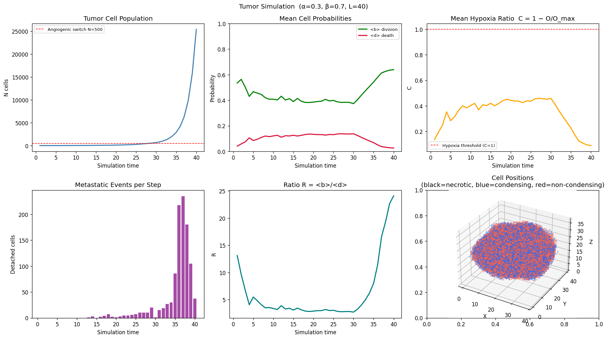

A second plot that shows:
* Oxygen concentration heat map
* Pro-angiogenic factor heat map

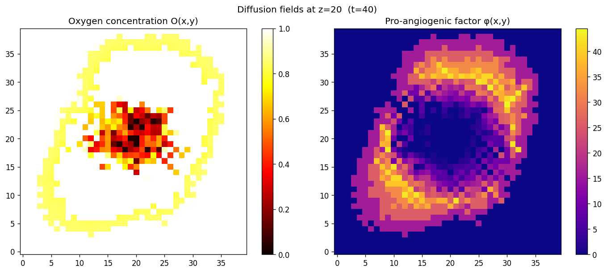

The results of the parameter sweep executed through parallel computation gives the following output in the terminal:

```bash
--- Comparing parameter pairs (α, β) in parallel ---
  [t=24] Angiogenic switch ON  (N=591)
  [t=26] Angiogenic switch ON  (N=556)
  α=0.3, β=0.5: final N=0, meta=0
  α=0.7, β=0.5: final N=0, meta=0
  [t=29] Angiogenic switch ON  (N=535)
  α=0.7, β=0.8: final N=29353, meta=2288
  α=0.3, β=0.7: final N=52168, meta=704
  α=0.3, β=0.8: final N=63395, meta=416

Comparison figure saved → results/tumor_comparison.png
```

Along with the following graph:

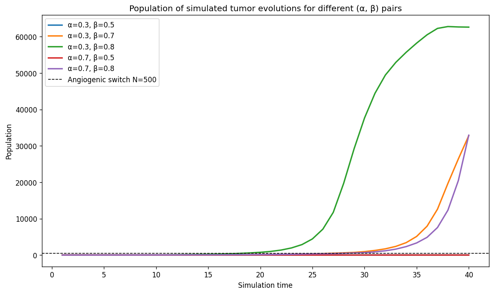

Besides these, the code exports major data from the last snapshot of all the cancer cells and the evolution of the key parameters of the tumor:

```bash
  Downsampling: 25377 cells → 5000 exported  (surface=4183, necrotic=44, interior=773/21150)
  Cell snapshot saved → ../3D_Viewer/data/tumor_cells.csv
  History saved       → ../3D_Viewer/data/tumor_history.csv  (40 steps)
```

After obtaining this results, the execution of the `3D_Viewer\viewer.py` gives an interactive 3D OpenGL viewer for visualizing cancer cell tumor simulations. The following images show the visual representation of the outside and inside of the tumor:

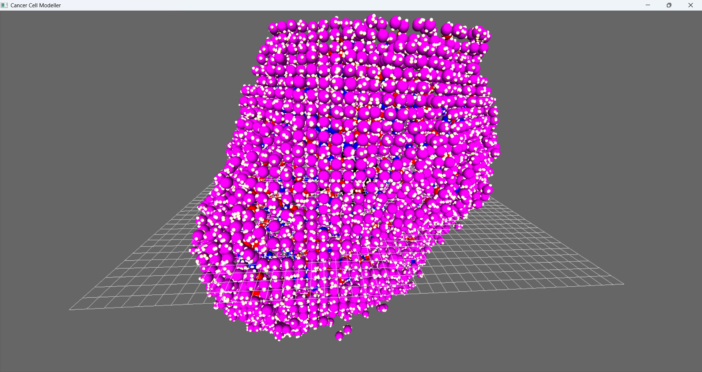

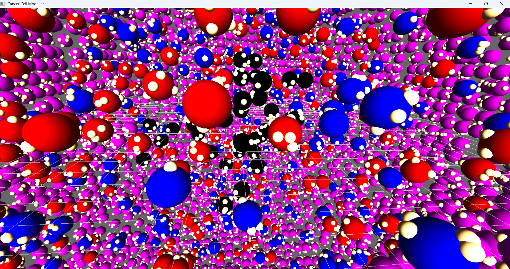

Here it is a small demonstration of the interactive GUI:


Where the colors for each cell represent the following:

| Phenotype | Colour | Hex | Biological Meaning |
|---|---|---|---|
| `necrotic` | ⚫ Black | `#000000` | Dead cells in the hypoxic core |
| `surface` | 🟣 Magenta | `#FF00FF` | Outermost cells with empty neighbours |
| `condensing` | 🔵 Blue | `#0000FF` | Cells with a condensation phenotype |
| `non-condensing` | 🔴 Red | `#FF0000` | Cells with a non-condensation phenotype |

---

### Batch Parameter Sweep

`batch_sweep.py` sweeps four parameters simultaneously — `α`, `β`, `γ`, and `N_A` — running `N_RUNS` independent stochastic simulations per combination, and computes four multi-objective Pareto metrics per run:

| Objective | Symbol | Direction | Definition |
|---|---|---|---|
| Fitness | FITNESS | maximise | `alive / (O_consumed × (1 + λ·meta))` |
| Metastatic Efficiency Index | MEI | minimise | `total_metastatic_events / final_population` |
| Necrotic Core Fraction | NCF | minimise | `necrotic_cells / total_cells` |
| Dissipation | DISSIPATION | minimise | `log(R² + 1) × (1 + λ_necro·NCF) × (1 + λ_meta·MEI)` |

where `R` is the geometric tumor radius estimated from the final cell count via `R = (3N / 4π)^(1/3)`, inspired by transport optimisation in river basin models, and the coefficients are fixed at `λ_necro = 1` and `λ_meta = 5`.

Necrosis and metastasis are not equivalent phenomena, so they are not weighted equally in `DISSIPATION`. Necrosis represents oxygen failure, internal collapse, and non-viable tissue — mostly a local inefficiency and an energetic failure. Metastasis represents invasive escape, loss of structural containment, and systemic spreading — a global instability that is clinically much more severe. Since `λ_meta > λ_necro`, the functional penalises metastatic spread more heavily than necrotic burden.

The full sweep has been extended to a perfectly rectangular **5⁴ grid** over `α`, `β`, `γ`, and `N_A`, with every cell populated:

| Parameter | Values | Count |
|---|---|---|
| α | 0.3, 0.4, 0.5, 0.6, 0.7 | 5 |
| β | 0.4, 0.5, 0.6, 0.7, 0.8 | 5 |
| γ | -0.2, -0.1, 0.0, 0.1, 0.2 | 5 |
| N_A | 200, 350, 500, 750, 1000 | 5 |
| **Total pairs** | **5⁴ = 625** | |
| **Total runs** | **625 × 100 = 62,500** | |

```python
ALPHA_VALUES = [0.3, 0.4, 0.5, 0.6, 0.7]
BETA_VALUES  = [0.4, 0.5, 0.6, 0.7, 0.8]
GAMMA_VALUES = [-0.2, -0.1, 0.0, 0.1, 0.2]
N_A_VALUES   = [200, 350, 500, 750, 1000]
```

This produces three output CSV files saved to `results/final-data/`:

| File | Rows |
|---|---|
| `pareto_summary.csv` | 625 |
| `run_summary.csv` | 62,500 |
| `raw_runs.csv` | 2,500,000 |

Earlier, smaller sweeps remain available as reference in the `results/` folder:

**`25 pairs-100 runs`** — 5α × 5β grid, 100 runs/pair:
```python
ALPHA_VALUES = [0.3, 0.4, 0.5, 0.6, 0.7]
BETA_VALUES  = [0.4, 0.5, 0.6, 0.7, 0.8]
```

**`36 pairs-200 runs`** — 6α × 6β grid, 200 runs/pair:
```python
ALPHA_VALUES = [0.3, 0.4, 0.5, 0.6, 0.7, 0.8]
BETA_VALUES  = [0.3, 0.4, 0.5, 0.6, 0.7, 0.8]
```

**`225 pairs-100 runs`** — 5α × 5β × 3γ × 3N_A grid, 100 runs/combo (intermediate sweep, superseded by the full 625-combination grid above):
```python
ALPHA_VALUES = [0.3, 0.4, 0.5, 0.6, 0.7]
BETA_VALUES  = [0.4, 0.5, 0.6, 0.7, 0.8]
GAMMA_VALUES = [-0.1, 0.0, 0.1]
N_A_VALUES   = [200, 500, 1000]
```

---

### Pareto Front Analysis

`Pareto_results.py` reads the three CSV files from `batch_sweep.py` and generates the figures described below for the full 625-combination sweep, saved to `results/final-data/pareto_plots/`.

#### Structural Dependency Note

`MEI` and `NCF` are not independent of `DISSIPATION`, since by definition `DISSIPATION` is built directly from both quantities. Treating all four objectives as independent Pareto axes therefore double-penalizes metastatic and necrotic behavior. This motivates two complementary analyses further below: a per-objective breakdown that treats Dissipation as a composite inheriting structure from the other three, and a reduced two-objective Pareto front that isolates the only structurally independent trade-off, between Fitness and Dissipation.

#### Strategy Classification

Pareto-front combinations are grouped into **four behavioral strategies** using KMeans clustering ($k=4$) on the four normalized objectives, with clusters labelled by whichever objective each centroid is most extreme in:

| Strategy | Color | Characteristics |
|---|---|---|
| **Efficient** | 🟢 Green | High fitness, low MEI, low NCF, low dissipation |
| **Invasive** | 🔴 Red | High MEI — disproportionate metastatic events relative to final population |
| **Necrotic** | 🟣 Purple | High NCF — large necrotic core, likely from rapid bulk growth outpacing vascularization |
| **Explosive** | 🟠 Orange | High dissipation — fast volumetric growth at high energetic cost |

**`01_strategy_classification.png`** — Three scatter panels (Fitness vs MEI, Fitness vs NCF, MEI vs NCF) on the Pareto front, color-coded by strategy, with a summary table of each cluster's qualitative profile beneath the panels.

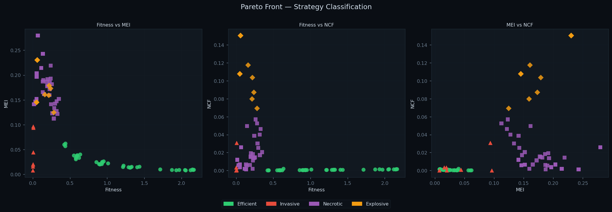

The Pareto front divides cleanly into the four zones. The MEI-vs-NCF panel is the clearest, with explosive runs concentrated in the upper-right sector, and only minor overlap between the invasive and efficient clusters in the Fitness-vs-MEI panel.

#### Pairwise Objective Trade-off Structure

**`02_tradeoff_matrix.png`** — Full 4×4 pairwise scatter matrix of the four objectives. The diagonal shows per-strategy frequency distributions, the lower triangle shows strategy-colored pairwise scatters, and the upper triangle reports the Pearson correlation coefficient for each pair on a diverging red-to-green scale.

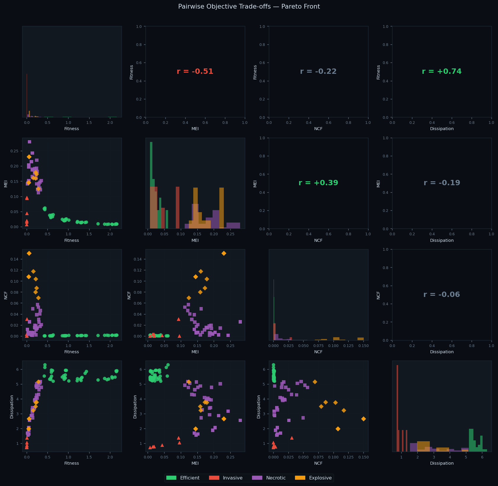

Fitness and Dissipation turn out to be strongly positively correlated: tumors that convert oxygen into viable biomass efficiently also tend to score higher on the dissipation functional, suggesting Dissipation behaves more like a measure of structural or transport-efficiency organization than a pure energetic penalty. Dissipation shows essentially no correlation with MEI or NCF. Fitness has a small negative correlation with both MEI and NCF, consistent with Fitness penalizing metastatic events while necrosis reflects poor oxygen efficiency. MEI and NCF are weakly positively correlated, meaning tumors with a large necrotic fraction also tend to have a higher metastatic-event ratio.

#### Parameter–Objective Phase Diagrams

For each objective, the α–β plane is rendered as a heatmap of the mean value over the 100 runs per combination, with one panel per (γ, N_A) pair — a 5×5 grid of subplots spanning all 25 (γ, N_A) combinations. α is the primary death/resistance axis and β the growth/division axis, so this plane captures the core competition between proliferation and cell loss; comparing panels shows how that competition shifts with γ and N_A.

**`03_phase_heatmaps_dissipation.png`**, **`03_phase_heatmaps_fitness.png`**, **`03_phase_heatmaps_mei.png`**, **`03_phase_heatmaps_ncf.png`** — one figure per objective, colour scale oriented so the optimal region is always the brighter end.

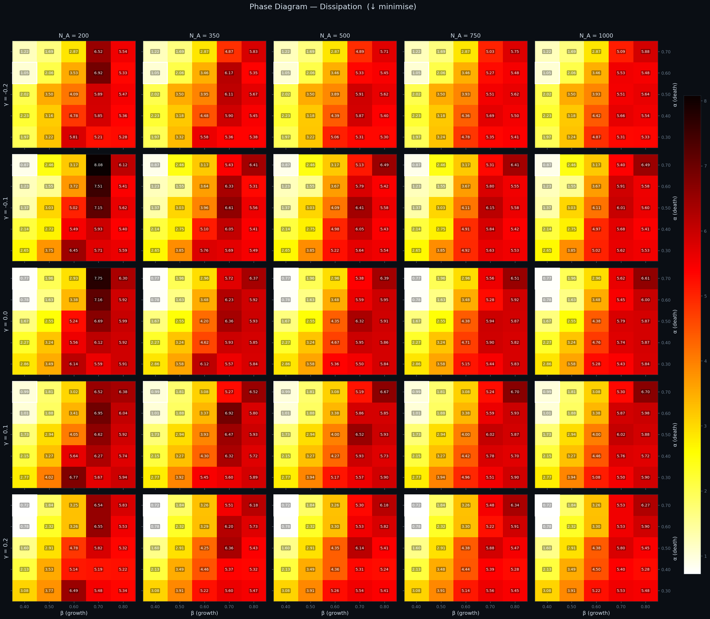

Dissipation is maximized at β=0.7 with higher α, regardless of γ or N_A. The peak shrinks visibly under γ=-0.1 relative to γ=0 and γ=+0.1; extending the sweep to γ=±0.2 shows this asymmetry largely washes out, since the ±0.2 pair tracks each other more closely than the ±0.1 pair did, and larger |γ| acts similarly to a higher N_A in damping the Dissipation peak. The minimum of Dissipation shows a smaller residual imbalance instead: γ=0 and γ=+0.2 bottom out at 0.77 and 0.72 respectively at (α, β)=(0.7, 0.4), while γ=-0.2 bottoms out higher, at 1.05, for the same (α, β). The high-Dissipation region also spreads further toward lower β at smaller N_A.

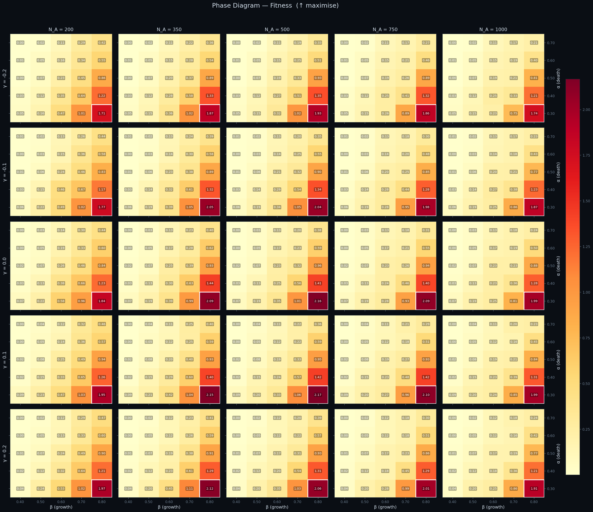

Fitness is maximized as β grows and α decreases, with no clear dependence on γ or N_A — Fitness appears to have low sensitivity to those two parameters.

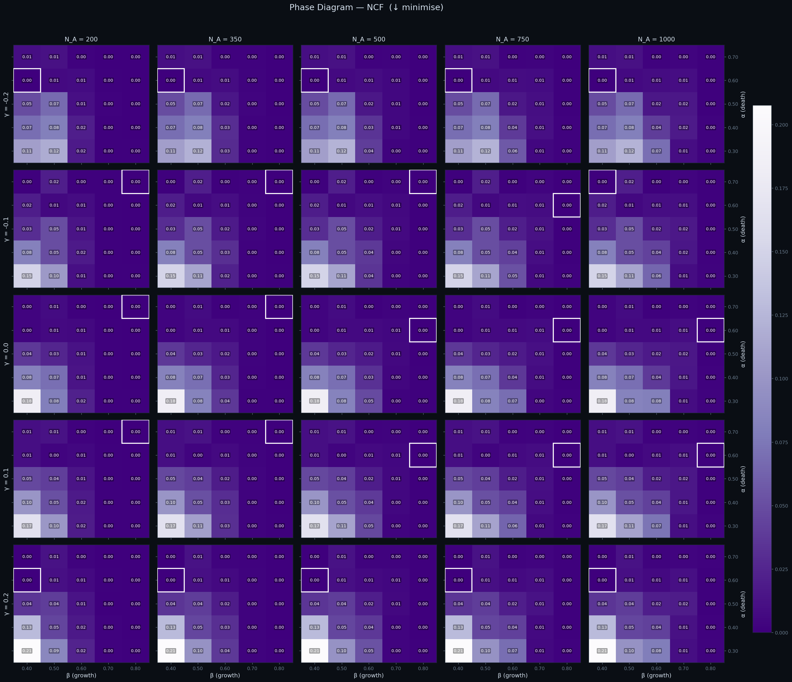

NCF is maximized when both α and β are minimized, regardless of γ, and grows further for smaller N_A, since a later angiogenic switch leaves cells longer in a hypoxic state before oxygen supply is restored. The γ=±0.1 pair shows little visible difference, but at the wider γ=±0.2 margin a clear asymmetry appears: the NCF maximum reaches only ≈0.12 at γ=-0.2 versus ≈0.21 at γ=+0.2, the largest phenotype imbalance observed among the four objectives.

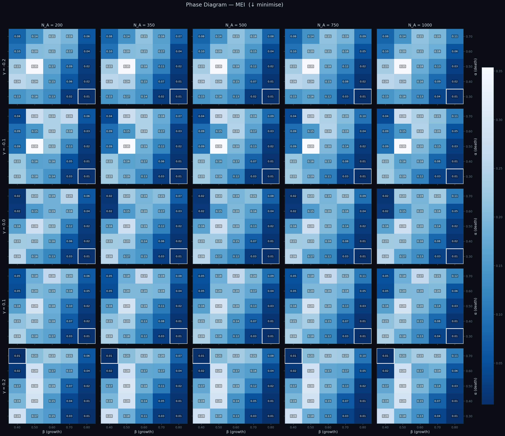

MEI is maximized near (α, β) = (0.5, 0.5) regardless of γ and N_A, with a higher peak under γ=-0.1 and γ=-0.2 than under γ=0, +0.1, or +0.2 — the same direction of phenotype asymmetry seen in Dissipation and NCF, and the one that motivates the formal significance test below.

#### Gamma Symmetry Significance Test

The phase-diagram heatmaps above treat γ as a directional "condensing" parameter, and several of them hint at a sign asymmetry: does γ=+0.1 (or +0.2) genuinely produce different tumor dynamics from γ=-0.1 (or -0.2), or are the visible differences just sampling noise across the 100 stochastic replicates per combination? This is tested formally for both symmetric magnitudes present in the augmented grid.

**`gamma_t_symmetry.png`**

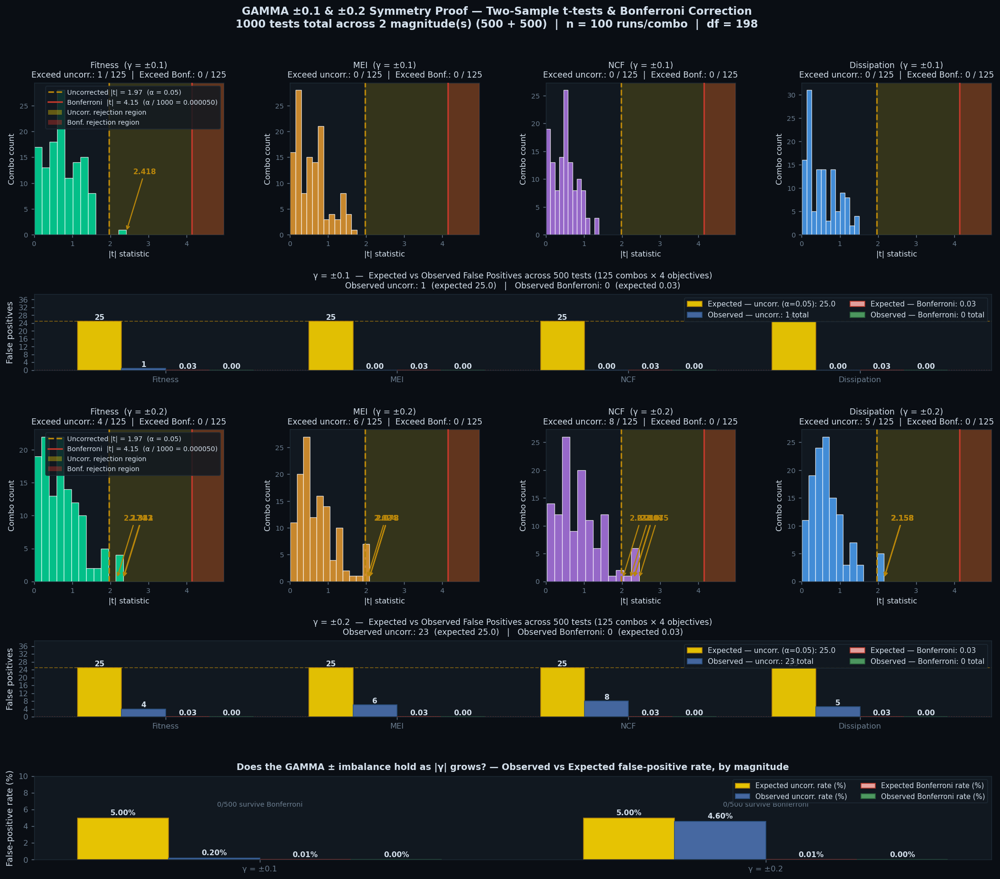

For every (α, β, N_A) combination simulated at both +γ and -γ, a Welch two-sample t-test compares the mean of each objective (Fitness, MEI, NCF, Dissipation) between the positive and negative runs, using the per-combination standard deviation and n=100 runs to estimate the standard error. This yields one |t| statistic per combo per objective — 125 combos × 4 objectives = 500 tests per magnitude, or 1,000 pooled across ±0.1 and ±0.2. Because running 1,000 independent tests would, by chance alone, push roughly 5% of |t| values above the uncorrected α=0.05 threshold even with no real effect, a Bonferroni correction (dividing α by 1,000) is applied across the pooled test suite, treating "is γ symmetric?" as a single family of hypotheses rather than testing each magnitude in isolation.

The exceedance rate against the uncorrected threshold is 0.2% for ±0.1 and 4.6% for ±0.2 — both at or below the 5% rate expected from chance alone under the null hypothesis of no true difference. Critically, zero of the 1,000 pooled tests survive the Bonferroni-corrected threshold. The small differences visible in the raw phase-diagram means above are therefore consistent with finite-sample noise rather than a true asymmetry between positive and negative γ, at either magnitude tested.

#### Individual Objective Analysis

Each objective gets a dedicated six-panel figure: (A) violin distributions stratified by β, (B) an α–β phase heatmap, (C) marginal sensitivity to all four parameters on a shared normalized axis, (D) Pearson correlation with the other three objectives, (E) the top-10 parameter combinations, and (F) a time-evolution proxy comparing the best- and worst-performing combinations, with ±1σ shading across the 100 stochastic replicates.

**`04_fitness.png`**

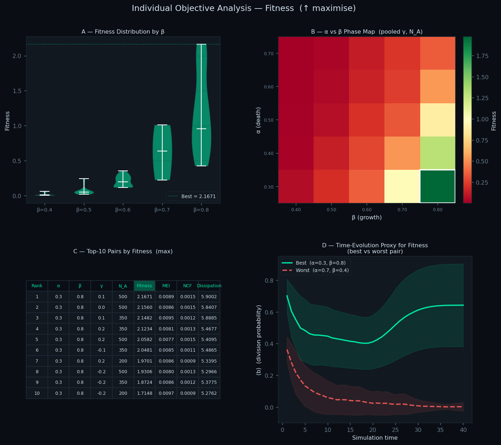

Fitness is maximized as β grows and α decreases, with increasing β visibly pulling combinations closer to the global optimum. The top combinations by maximum Fitness sit around (α, β, N_A) = (0.3, 0.8, 500). The worst-Fitness run starts with a division probability ⟨b⟩(0) ≈ 0.38 that decays asymptotically toward 0; the best-Fitness run starts near ⟨b⟩(0) ≈ 0.75, dips toward ≈0.45 around t≈10 (likely the angiogenic switch), then recovers and stabilizes near ⟨b⟩ ≈ 0.63 by the end, with fairly large variance throughout.

**`04_mei.png`**

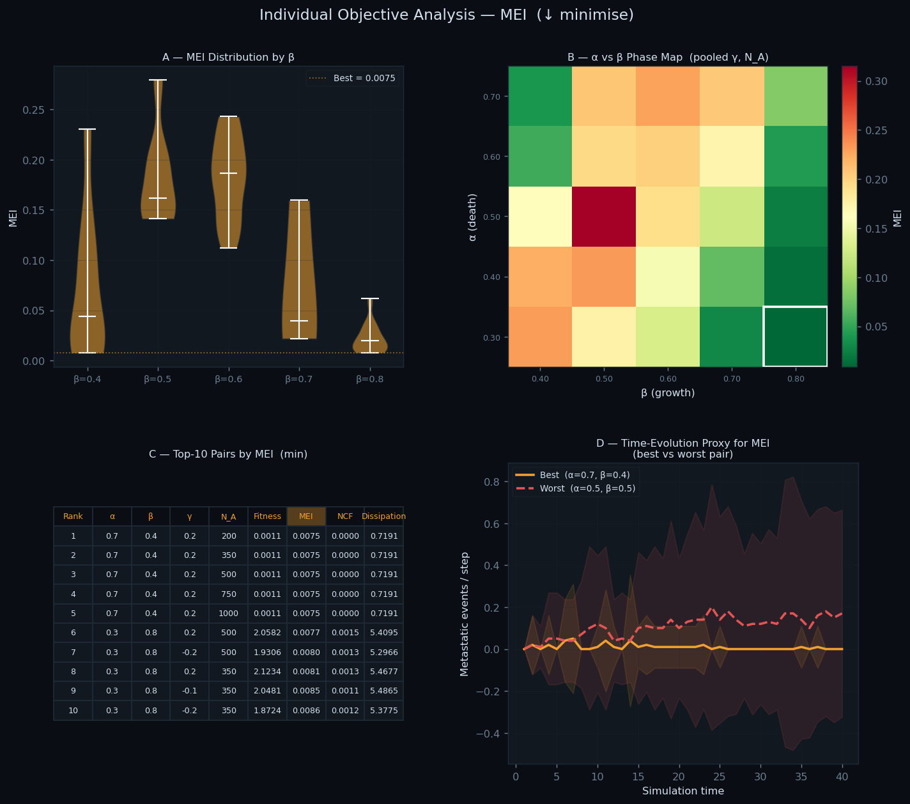

The direction that minimizes MEI is less clear-cut: both very low and very high values of β tend to sit near the global optimum, while (α, β) = (0.5, 0.5) maximizes MEI. Low-β tumors die too quickly to form the irregular structures that enable metastasis; high-β tumors do form those structures, but grow so large that the metastatic ratio gets diluted by the final population size. Top combinations by minimum MEI cluster around (α, β) = (0.3, 0.8). The worst-MEI run stays nearly flat in raw metastatic-event count but reaches only a small, stable final population, inflating the ratio; the best-MEI run produces more metastatic events overall, mostly once growth reaches the edges of the cubic lattice — where flat boundary walls suppress further metastasis, likely an artifact of the lattice geometry rather than the underlying biology.

**`04_ncf.png`**

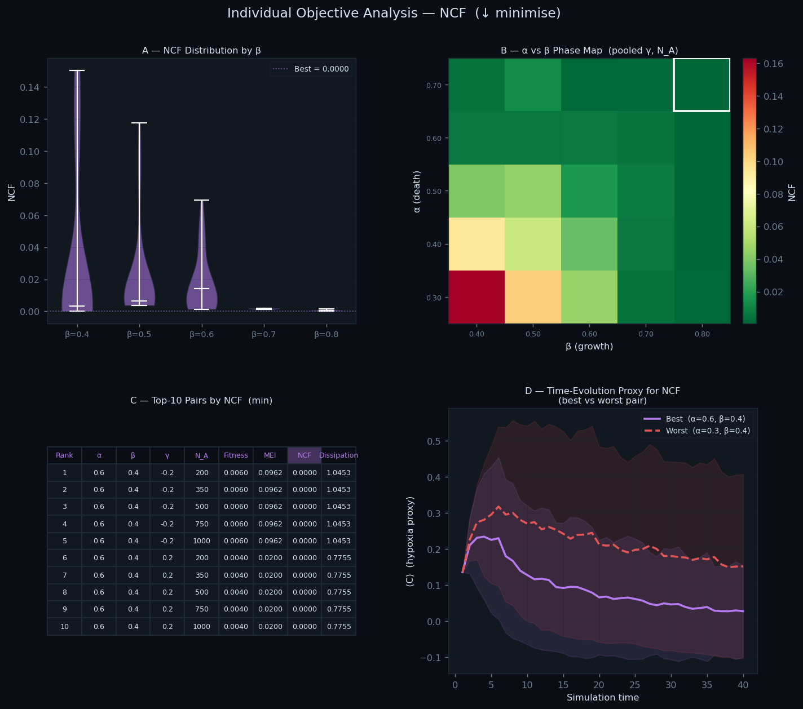

NCF is minimized when both α and β are maximized: fast cell turnover leaves less time for cells to sit in a hypoxic state before becoming necrotic, whereas slow turnover (small α, β) drives NCF toward its maximum. The top combinations by minimum NCF cluster at (α, β) = (0.7, 0.8) with low N_A, since an earlier angiogenic switch shortens the hypoxic window. The worst-NCF run starts near ⟨C⟩(0) ≈ 0.14, jumps to ≈0.3 by t≈8, and fluctuates with high variance from there with a slight downward trend; the best-NCF run follows a similar early trajectory but its hypoxia ratio begins decreasing around t≈20, likely once the tumor crosses the angiogenic threshold and gains fresh oxygen supply.

**`04_dissipation.png`**

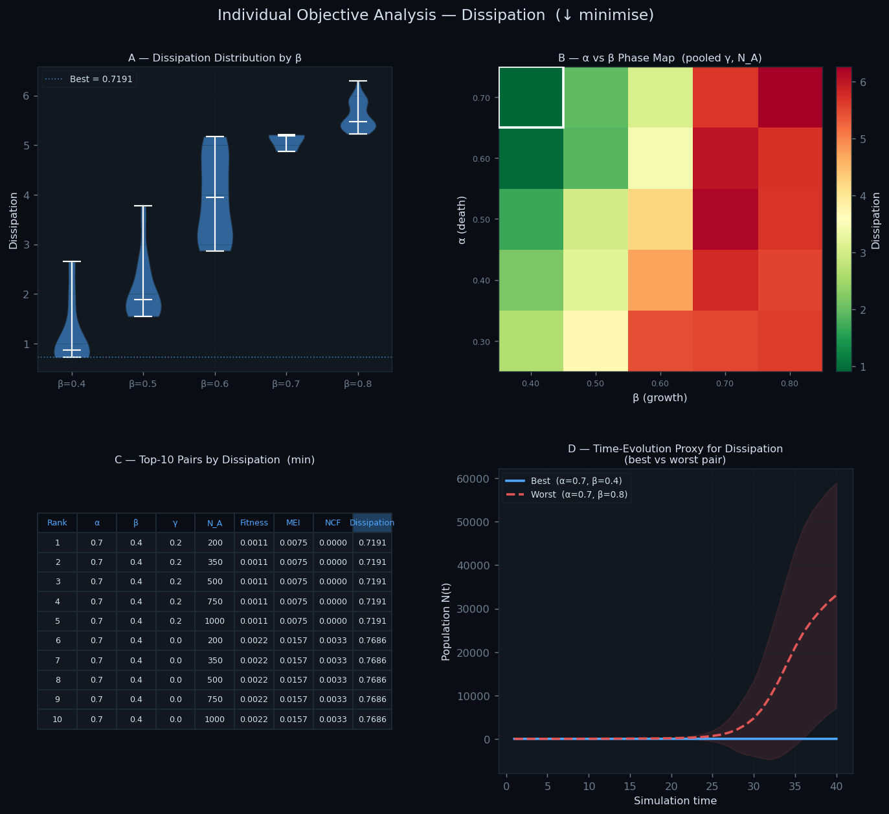

As the most composite objective, Dissipation inherits structure from R, NCF, and MEI together. The variance decomposition (see [Dissipation Component Analysis](#dissipation-component-analysis) below) confirms that geometry $R^2$ overwhelmingly dominates, with NCF and MEI acting as secondary multipliers. This motivates the reduced two-objective analysis below. At the parameter-combination level, Dissipation is minimized when α is maximized and β is minimized — a rapidly dying tumor with a small geometric footprint — with decreasing β moving combinations consistently toward the minimum. The top combinations by minimum Dissipation sit near (α, β) = (0.7, 0.4), with γ=0 also favored, suggesting tumors that do not differentiate strongly between cell phenotypes incur the lowest transport cost. The worst-Dissipation run starts from a small population and shows a steep logistic increase around t≈20 until it saturates near the lattice's carrying capacity; the best-Dissipation run stays nearly flat, since death consistently outpaces division and the tumor dies out early.

Across all four objectives, sensitivity (Panel C) is consistently dominated by α and β, with γ and N_A playing a much smaller role — though Dissipation and NCF do show a small marginal sensitivity to increasing N_A.

#### Reduced Two-Objective Pareto Front

Because MEI and NCF are algebraically embedded in Dissipation, the only structurally independent Pareto trade-off is between Fitness and Dissipation. A separate 2D Pareto front is recomputed directly in the (Fitness, Dissipation) plane: a combination sits on this front if no other combination simultaneously achieves higher Fitness and lower Dissipation.

**`05_two_objective_pareto.png`**

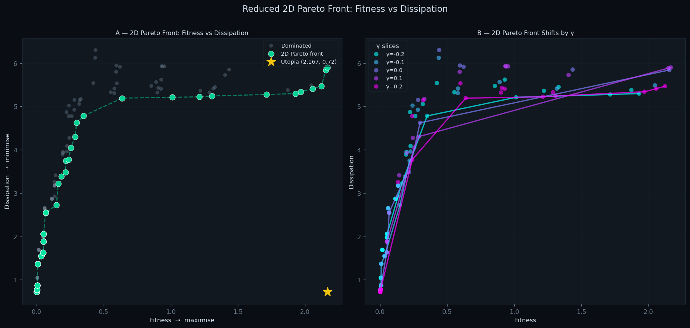

* **Panel A — 2D Pareto front.** All 625 combinations plotted in the Fitness–Dissipation plane. Points on the 2D front are highlighted; dominated points are shown in grey. The unreachable *utopia point* (max Fitness, min Dissipation) is marked with a star.
* **Panels B and C — NCF and MEI as diagnostic quantities.** The same scatter recolored by NCF (B) and by MEI (C). Points deviating furthest above the efficient frontier (high Dissipation for a given Fitness) are precisely those with high necrotic fraction or high metastatic index, reframing NCF and MEI as quantities that *explain* excess dissipation above the geometric baseline rather than independent objectives.
* **Panel D — Front shifts by γ.** Each value of γ is plotted as its own scatter with its own 2D front, to check whether the condensing-phenotype parameter shifts the achievable Fitness range, the achievable Dissipation range, or both.

This analysis clarifies what the Fitness–Dissipation scatter is actually showing. The apparent "contradiction" — that high-Fitness and high-Dissipation combinations cluster together rather than opposing each other — is resolved by recognizing **Simpson's Paradox**: at the macroscopic level of parameter combinations, the positive Fitness–Dissipation relationship reflects the fact that the most biologically capable tumor regimes simultaneously demand the highest transport capacity. Dissipation in this frame is not a cost to be avoided but a **transport demand metric**, and the Pareto front in this plane traces the set of regimes achieving the most viable biomass for a given level of structural complexity. NCF and MEI (Panels B and C) then account for excess Dissipation above the pure geometric baseline $R^2$, reframing them as explanatory correctors rather than independent objectives.

#### Multi-Objective Consensus and Parameter Convergence

To check whether any combinations perform well across all four objectives at once, every Pareto-front combination is assigned a **consensus score** $s \in \{0,1,2,3,4\}$, equal to the number of objectives for which it lands in the top quartile. A score of 4 indicates unambiguous multi-objective efficiency; a score of 0 indicates a narrow specialist competitive on at most one axis.

**`06_convergence.png`**

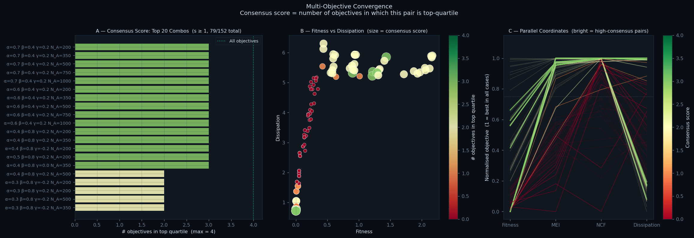

* **Panel A — Ranked consensus bar chart.** Every Pareto-front combination, sorted by consensus score and shown as a horizontal bar colored from red ($s=0$) to green ($s=4$); combinations reaching $s=4$ are labelled by their $(\alpha,\beta,\gamma,N_A)$ values.
* **Panel B — Consensus score in Fitness–Dissipation space.** The same scatter from the previous section, with point size and color both encoding consensus score; large green points near the upper-left (high Fitness, low Dissipation) are the most robustly efficient combinations.
* **Panel C — Parallel coordinates.** Each Pareto-front combination drawn as a polyline across four normalized objective axes (1 = best achievable value in all cases), colored and opacity-weighted by consensus score, to reveal whether the top-scoring combinations cluster tightly or spread across the front.

A handful of combinations achieve a strong trade-off across at least three of the four objectives — maximizing Fitness while minimizing MEI, NCF, and Dissipation. Because the macroscopic Fitness–Dissipation correlation is positive, truly high-consensus combinations sit in a regime where aggressive biological capability and high transport demand co-occur; the consensus score therefore rewards combinations that are structurally efficient across all dimensions simultaneously, not just large or fast-growing.

#### Dissipation Component Analysis

`Pareto_results.py` also generates a dedicated set of correlation and variance-decomposition diagnostics that ground the multiscale interpretation above in quantitative evidence. Results are saved alongside the other figures in `results/final-data/pareto_plots/`, and the decomposition table is exported as `objective_variance_decomposition.csv`.

The log-space structural decomposition of Dissipation is:

$$\log D = 2\log R + \log(1+\lambda_n\,\text{NCF}) + \log(1+\lambda_m\,\text{MEI})$$

This lets variance contributions be cleanly attributed to each component.

**Size–Dissipation correlations (log–log Pearson $r$):**

| Metric | Full dataset (625 combos) | Pareto-front subset (152 combos) |
|---|---|---|
| log(D) vs log(N) | 0.743 | 0.627 |
| log(D) vs log(R) | 0.831 | 0.810 |

**Variance decomposition of log(D):**

| Component | Full (% of variance) | Pareto-front (% of variance) |
|---|---|---|
| Geometry $R^2$ | 827.6% | 387.3% |
| Necrosis NCF | 7.3% | 3.8% |
| Metastasis MEI | 1.8% | 1.1% |

The variance percentages exceed 100% collectively because the additive log-space components are correlated with each other; what matters is the relative hierarchy: **geometry dominates by orders of magnitude**, with NCF and MEI as small but non-trivial correctors. On the Pareto front, the geometry contribution drops (less size-driven variation among non-dominated solutions), while the biological multipliers retain their relative role.

**Partial correlation — Dissipation vs Fitness controlling for log(N):**

After partialling out shared tumor-size variation, the residual correlation between Dissipation and Fitness is:
- Full dataset: partial $r = +0.484$
- Pareto-front subset: partial $r = +0.682$

This non-trivial positive residual confirms that Dissipation retains independent information about Fitness beyond tumor size, capturing genuine transport-cost heterogeneity across regimes. The strengthening of the partial $r$ on the Pareto front (0.48 → 0.68) means that among non-dominated solutions, the transport-capacity signal is even cleaner: Pareto-optimal tumors with similar sizes but different Dissipation values are genuinely accessing distinct biological strategies.

**Overall correlation structure**

**`07_pairplot_correlation.png`** extends the trade-off matrix from [Pairwise Objective Trade-off Structure](#pairwise-objective-trade-off-structure) into a single 6×6 matrix that adds Population N and Radius R alongside the four objectives, so the size variables driving the diagnostics above can be inspected directly: the lower triangle shows the raw scatter (full grid vs. Pareto front), the diagonal shows overlaid distributions, and the upper triangle reports Pearson r for both datasets. This single figure supersedes the separate scatter-matrix and correlation-heatmap figures used earlier in the analysis.

This resolves an apparent puzzle from the raw Dissipation–NCF and Dissipation–MEI scatter panels: even though Dissipation is constructed to *increase* multiplicatively with both NCF and MEI, the raw Pearson correlations are *negative* (r=-0.31 NCF, -0.34 MEI on the full grid; -0.06, -0.19 on the front). This is a confounding effect rather than a contradiction of the functional form — both NCF and MEI are themselves negatively correlated with tumor size (r=-0.38/-0.53 for NCF vs. N/R, and -0.62/-0.53 for MEI vs. N/R on the full dataset), and size is overwhelmingly the dominant driver of Dissipation (r=0.68 with N, 0.81 with R). Since large, low-necrosis, low-metastasis tumors are the common case in this grid, the indirect size channel masks and inverts the direct multiplicative effect in the raw correlation — exactly why the partial-correlation and variance-decomposition analyses above, which explicitly control for size, were needed to recover the genuine, positive transport-cost contribution of NCF and MEI to Dissipation.

The MEI–Fitness correlation is the strongest pairwise relationship not involving Dissipation or size (r=-0.64 full, -0.51 front), but it too is largely a size effect rather than evidence that metastatic events are intrinsically costly to Fitness: MEI correlates negatively with both N (-0.62) and R (-0.53), while N and R correlate positively with Fitness (0.53, 0.43). This is the same dilution mechanism already identified qualitatively in the [individual objective analysis](#individual-objective-analysis) of MEI above — big tumors rack up a similar absolute number of metastatic events as small ones but divide it by a much larger final population, so MEI falls as size grows, dragging the raw MEI–Fitness correlation negative even without a direct causal penalty. NCF–Fitness is comparatively weak (-0.32 full, -0.22 front) and weakens further on the front, consistent with the NCF-ceiling effect: Pareto-optimal tumors cluster near the upper bound of achievable NCF, so within that subset NCF carries less discriminating power over Fitness than it does across the full grid.

Two further patterns round out the picture. Dissipation–Fitness is positive and strengthens on the Pareto front (0.59 → 0.74), tracking closely with the partial correlation reported above (0.484 → 0.682) — the clearest single-number confirmation that more successful (higher-Fitness) tumors on the front sustain a larger dissipation burden, not a smaller one, reinforcing the "transport cost of success" reading of Dissipation from the individual objective analysis. NCF–MEI is positively correlated (0.47 full, 0.39 front), indicating that necrotic and metastatic tendencies tend to co-occur rather than trade off, plausibly driven by the same underlying irregular-growth/condensing-phenotype regime identified in [Strategy Classification](#strategy-classification) rather than representing independent failure modes.

The complete set of diagnostic figures:

| Figure | Content |
|---|---|
| `07_dissipation_vs_N.png` | Dissipation vs population (log–log), full dataset and Pareto front |
| `07_dissipation_vs_R.png` | Dissipation vs radius (log–log), both datasets |
| `07_dissipation_vs_ncf.png` | Dissipation vs NCF, both datasets |
| `07_dissipation_vs_mei.png` | Dissipation vs MEI, both datasets |
| `07_dissipation_vs_fitness.png` | Dissipation vs Fitness, both datasets |
| `07_partial_fitness.png` | Partial correlation after partialling out log(N) |
| `07_variance_decomposition.png` | Variance contribution bar chart per component |
| `07_pairplot_correlation.png` | Merged 6×6 scatter matrix and Pearson correlation heatmap (objectives + N + R), full dataset vs. Pareto front |

---

## Minor Project: Experimental Data

### Project Context

This section documents a complementary experimental strand carried out during a 10-week research stay at [Sdelci's Lab](https://sdelcilab.crg.eu/) at the [Centre for Genomic Regulation (CRG)](https://www.crg.eu/en/programmes-groups/sdelci-lab), supervised by Dr. Camilla Reiter Elbæk. The work analyses fluorescence-microscopy data from experiments on the inhibition of MCT1/4 — a lactate transporter whose loss increases histone lactylation levels, limits metastatic dissemination, and modulates primary tumour growth. Results from this wet-lab data are used to fit parameters of the main computational model, bridging experiment and simulation within the thesis.

The biological context: histone lactylation is a post-translational modification linking cellular metabolism to chromatin state. MCT1 loss elevates lactylation, reducing LDHB protein and reshaping transcriptional plasticity. Pharmacological elevation of lactylation limits metastatic spread in immunocompromised models and synergises with immunotherapy in immunocompetent settings.

### Image Analysis Pipeline

Tumour spheroid images from 5 imaging sessions (folders under `results/SLURM/`) are processed through a six-step pipeline implemented in `tissue-if/`:

**Step 1 — Build slide layout** (`build_slide_layout.py`): detects tissue boundaries using edge analysis and outputs `fields_to_analyze.tsv` plus QC images.

**Step 2 — Split into chunks** (`make_field_chunks.py`): divides fields into parallel-processing chunks of ~40 fields each.

**Step 3 — Cellpose segmentation** (`analyze_tissue_cellpose_multichannel.py`): runs nucleus segmentation in parallel via SLURM array jobs.

**Step 4 — Merge outputs** (`merge_array_outputs.py`): combines chunk results into a single `combined_nuclei.parquet` per imaging session.

**Step 5 — Classify spatial zones** (`classify_spatial_zones.py`): assigns each nucleus to one of three zones using KD-tree nuclear density with absolute thresholds: necrotic core (<200 neighbours), transition zone (200–600), and live tissue (>600). Outputs `zone_classifications.tsv` and per-tumour QC plots.

**Step 6 — Intensity analysis** (`tumor_analysis.py`): reads the parquet files from all sessions, applies morphological QC filters and per-tumour intensity gates, and writes per-group and per-tumour summary statistics and violin plots to `results/SLURM/tumor_analysis/`.

The key outputs consumed by the Pareto matching pipeline below are:
- `combined_nuclei_with_metadata.parquet` — all nuclei with QC flags and zone labels
- `tumor_metadata.tsv` — folder paths, tumour names, well columns, and treatment assignments (Control / Treated)
- per-folder `zone_classifications.tsv` files — nucleus-level spatial zone labels

### Pareto Matching Pipeline

`pareto_experimental_matching.py` is a dual-mode script (standalone / Jupyter cell-by-cell) that connects the experimental imaging data to the simulation Pareto front in two sequential stages.

#### Stage A — Experimental Observables

Stage A reads `tumor_metadata.tsv` from `results/SLURM/` together with the per-folder parquet and zone classification files, and computes the following simulation-compatible observables for each tumour:

| Observable | Experimental source | Simulation target |
|---|---|---|
| NCF | Necrotic nuclei / total nuclei (zone counts) | mean_ncf |
| hypoxia_proxy | Transition fraction / viable fraction | C_est (mean ⟨C⟩) |
| R_eff | Gyration radius of nuclei spatial coordinates | R_sim |
| alpha_structural_proxy | NCF / transition_fraction | α |
| beta_proxy | ch488 (KI67) live / necrotic intensity ratio | β |
| condensing_proxy | (KI67/DAPI) × (H3K18lac/DAPI) in live zone | γ |
| ki67_gradient | ch488 live / transition intensity ratio | β(1+γ) |
| warburg_adaptation | ch546 transition / live intensity ratio | N_A |

After filtering one SKIP-flagged tumour (AA11 from `2026.05.27 AA11_A9BA_A8A0_20x`; a replicate in `2026.05.28 A8A0_A11_REP_20x` was retained as an independent measurement), Stage A produces **13 usable spheroids**: 6 Control and 7 Treated.

A structurally important constraint emerges immediately: the simulated Pareto-front NCF ceiling is approximately 0.150, while experimental NCF values span [0.016, 0.169]. All but the lowest-NCF spheroids exceed this ceiling, meaning the matching algorithm cannot discriminate between tumours through NCF alone — all tumours map to the high-NCF boundary, and inter-tumour discrimination is carried entirely by the secondary observables, principally `beta_proxy` (Control ≈ 0.55 vs. Treated ≈ 0.50 in matched β).

Stage A writes `ncf_per_tumor.csv` as a bridge file consumed by Stage B. The three outputs from Stage B are `matching_results.csv`, `group_summary.csv`, and `group_representatives.csv`.

#### Stage B — Pareto Matching Figures

For each experimental tumour Stage B computes a weighted L2 distance to all 152 Pareto-front points in jointly-normalised observable space, finds the top-3 closest matches, and produces six figures.

**`pareto_front_strategy_map.png`**

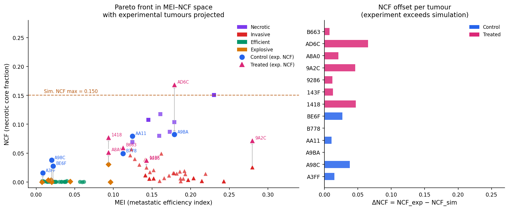

The left panel reproduces the Pareto front in the MEI–NCF plane, with the 152 points coloured and shaped by their strategy cluster (Efficient, Invasive, Necrotic, Explosive). Experimental tumours are overlaid at their rank-1 matched MEI value (a model prediction, not a direct measurement) and their actual experimental NCF. Vertical arrows span the ΔNCF = NCF_exp − NCF_sim gap. The right panel shows this ΔNCF per tumour as a horizontal bar chart.

The dashed horizontal line at NCF_sim_max ≈ 0.150 confirms the systematic NCF offset: all experimental tumours plot above it, with arrows pointing uniformly upward. The offset is largest for AD6C (ΔNCF = +0.065, highest-NCF Treated tumour) and smallest for B778 (ΔNCF = −0.003, the only Control tumour that nearly reaches the simulated ceiling). Despite the global offset, matched MEI values spread meaningfully across the front: Control tumours (circles) tend to cluster in the Efficient and Invasive regions, while Treated tumours (triangles) cluster more in the Invasive and Explosive zones, with AD6C and A9BA/AA11 pushed into the Necrotic region.

**`parameter_space_alpha_beta.png`**

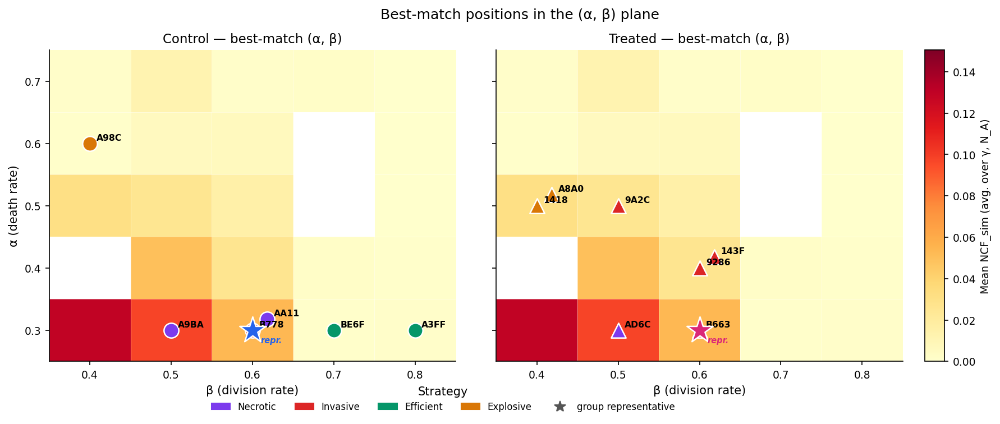

A heatmap of mean NCF_sim in the α–β plane (averaged over γ and N_A), one panel per treatment group, with each tumour's best-match position overlaid as a strategy-coloured marker. The group centroid-match representative (see below) is shown as a large ★ in each panel.

Control tumours scatter broadly across the (α, β) plane: A3FF matches to the high-β, low-α Efficient corner; A98C maps to the intermediate α=0.6, β=0.4 Explosive cell; B778, BE6F, and AA11 cluster around α ∈ {0.3, 0.4}, β ∈ {0.6, 0.7}; and A9BA falls at (α=0.3, β=0.5) in the Necrotic zone. Treated tumours are noticeably more concentrated: five of the seven cluster in a narrow α ∈ [0.4, 0.5], β ∈ [0.4, 0.6] band around the (0.5, 0.5) saddle previously identified as the MEI-maximising region, suggesting that MCT1/4 inhibition shifts the tumour population toward a less proliferatively efficient but more metastatically active regime.

**`group_parameter_comparison.png`**

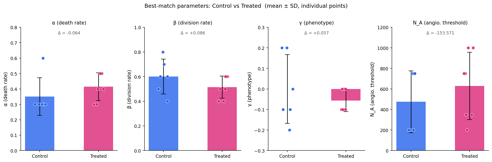

Four-panel bar chart comparing mean ± SD of the best-match free parameters (α, β, γ, N_A) between Control and Treated, with individual tumour values shown as strip points. The clearest separation is in β: Control tumours match to higher division rates (β̄ = 0.60) than Treated (β̄ = 0.51, Δβ = +0.086). Control tumours also match to lower α (ᾱ = 0.35 vs. 0.41, Δα = −0.064), indicating faster net growth. The γ and N_A differences are smaller (Δγ = +0.057, ΔN_A = −153.6): Control tumours have a slightly more balanced phenotype (γ̄ ≈ 0) and activate the angiogenic switch earlier (N̄_A = 475 vs. 629). Standard deviations are large relative to the group differences for all four parameters; with only 6 and 7 tumours per group, none of these differences should be interpreted as statistically established without formal hypothesis testing.

**`group_objective_comparison.png`**

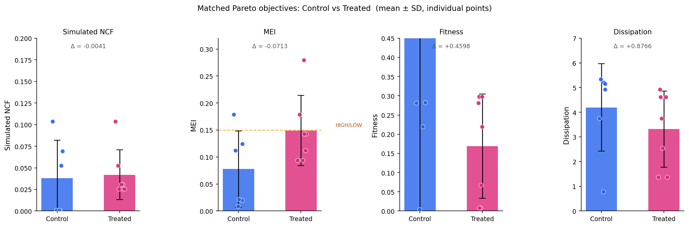

Same layout as the parameter comparison figure but for the four matched Pareto objectives (NCF_sim, MEI, Fitness, Dissipation). The MEI panel includes a dashed line at the MEI = 0.15 HIGH/LOW threshold.

The most striking contrast is in Fitness: Control tumours match to points with mean F̄ = 0.628, while Treated tumours match to much lower-fitness points at F̄ = 0.169 (ΔFit = +0.460). This is a direct consequence of the β shift: the matched Pareto points for Controls include the high-β Efficient cluster, which carries very high Fitness, whereas Treated tumours concentrate in the Invasive/Explosive cluster with intrinsically low Fitness. MEI shows the inverse pattern: Treated tumours match to nearly twice the metastatic index of Controls (0.149 vs. 0.078, ΔMEI = −0.071), and 28.6% of Treated tumours land in the HIGH-MEI regime vs. only 16.7% of Controls. Matched NCF_sim is almost identical between groups (0.038 vs. 0.042), confirming the NCF ceiling effect renders this objective non-discriminating. Dissipation is higher for Control (4.19 vs. 3.31), reflecting the larger geometric footprint of the high-β Efficient cluster, consistent with the "transport cost of success" interpretation.

**`parallel_coordinates.png`**

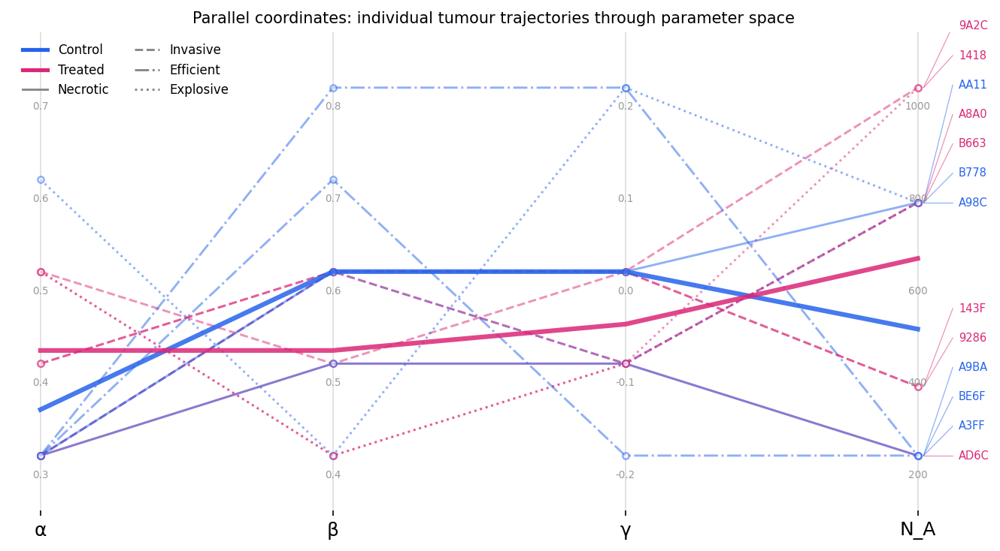

Each tumour's rank-1 matched parameter combination is drawn as a polyline through four normalised vertical axes (α, β, γ, N_A), with line colour encoding treatment group and line style encoding matched strategy. Thick lines show the group mean trajectories.

The mean trajectories summarise the group separation most compactly: the Control mean polyline descends steeply from a low-α position to a high-β position, while the Treated mean polyline is higher on α and lower on β, crossing the Control line between the two axes — the geometric signature of the (α, β) displacement seen in the previous two figures. Individual Control lines show that the spread is driven by the A3FF and A98C outliers. Treated trajectories are more tightly bundled on β and α, consistent with the smaller standard deviations in the group summary. The γ axis shows no clear separation between groups (both means pass through near-zero), while N_A favours higher thresholds for Treated, though with large intra-group spread.

**`per_tumour_distance_ranking.png`**

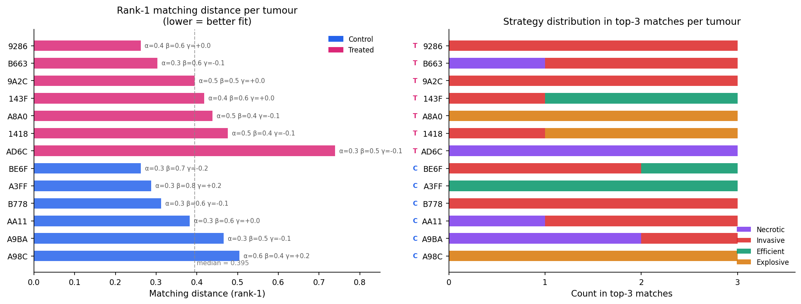

Left: rank-1 matching distance per tumour as a horizontal bar (coloured by group, sorted worst-to-best within each group), with the best-match (α, β, γ) tuple annotated on each bar and the median distance marked as a dashed line. Right: stacked bar showing how many of each tumour's top-3 candidates belong to each strategy cluster.

AD6C (Treated) is the hardest tumour to match (d = 0.739), expected given its experimental NCF of 0.169 — the most extreme violation of the simulated NCF ceiling. A9BA (Control, d = 0.466) and A98C (Control, d = 0.505) are the next poorest fits for the same reason. Most tumours fall near or below the median distance (≈ 0.42), with A3FF (d = 0.288) and 9286/B663 (d = 0.262 / 0.303) achieving the closest matches. The strategy distribution panel shows that for most tumours all three top candidates share the same strategy label, indicating unambiguous matching in strategy space. The only exception is BE6F (Control), whose top-3 span both Efficient and Invasive. Treated tumours are dominated by Invasive top-3 matches, with AD6C consistently Necrotic and 1418/A8A0 consistently Explosive.

#### Group Representative Pareto Point (Centroid-Match)

The per-tumour matching above yields one best-match parameter combination per spheroid, from which group-level means can be computed. However, the arithmetic mean of Pareto-front grid points does not in general land on the Pareto front itself. A more rigorous group representative is the **centroid match**: the single Pareto-front point (α\*, β\*, γ\*, N_A\*) that minimises the mean weighted L2 distance to all tumours in the group simultaneously. For the squared weighted-L2 objective this is equivalent to finding the Pareto point nearest to the group centroid in normalised observable space.

| Group | n | ᾱ dist | α\* | β\* | γ\* | N_A\* | Strategy | NCF_sim | MEI | Fitness | Dissipation | β(1+γ) | C_est |
|---|---|---|---|---|---|---|---|---|---|---|---|---|---|
| Control | 6 | 0.240 | 0.3 | 0.6 | +0.1 | 500 | Invasive | 0.046 | 0.121 | 0.329 | 5.173 | 0.660 | 0.370 |
| Treated | 7 | 0.313 | 0.3 | 0.6 | −0.1 | 750 | Invasive | 0.052 | 0.112 | 0.282 | 4.922 | 0.540 | 0.379 |

**Key finding:** both groups map to identical nominal death and division rates (α\* = 0.3, β\* = 0.6) and both are classified as Invasive. The entire group-level distinction is encoded in just two parameters: γ (+0.1 for Control vs. −0.1 for Treated, Δγ = +0.2) and N_A (500 for Control vs. 750 for Treated, ΔN_A = −250).

The γ shift has a direct biological reading through the effective rim division rate β(1+γ): Control tumours have a normoxic-rim division rate of 0.660, while Treated tumours have 0.540 — a 22% reduction — despite identical nominal β. This means the treatment does not uniformly reduce proliferative capacity; instead, it appears to act through the phenotypic balance encoded in γ, shifting toward the negative-γ regime that the phase diagrams associated with higher MEI and NCF. The N_A shift reinforces this: Treated tumours activate angiogenesis later (750 vs. 500), allowing hypoxic conditions to persist longer, consistent with their slightly higher matched NCF_sim (0.052 vs. 0.046).

The objective differences between the two representatives are modest in absolute terms (ΔFit = +0.048, ΔMEI = +0.009, ΔDis = +0.250) and considerably smaller than the arithmetic-mean differences from the per-tumour analysis (ΔF̄it = +0.460, ΔM̄EI = −0.071). This discrepancy reflects the methodological distinction: per-tumour means are pulled by a small number of extreme Control outliers (A3FF, BE6F) that match to the high-Fitness Efficient cluster, while the centroid match minimises distance to all tumours simultaneously and is less sensitive to those outliers. The two summaries are complementary — per-tumour averages capture the full distributional range including outliers; the centroid representative characterises the modal phenotype of each group.

The centroid distances (0.240 for Control, 0.313 for Treated) confirm that Control tumours cluster more tightly around their representative than Treated tumours, consistent with the narrower parameter spread seen in the parallel coordinates and the lower standard deviations in the group summary.

Three methodological caveats apply throughout this analysis. First, the **NCF ceiling effect**: all experimental NCF values either reach or exceed the simulated Pareto-front maximum (≈ 0.150), so matched NCF_sim is not a discriminating quantity and group discrimination rests entirely on secondary observables. Second, **MEI is a model prediction**: the matched MEI read from the rank-1 Pareto point is not a direct experimental measurement and should be reported as such. Third, **per-tumour averages and centroid representatives are complementary, not equivalent**, and both should be reported together rather than one chosen over the other.

---

## References

1. Terradellas Igual, A. (2019). *Fractal dynamics and cancer growth.* (Master Thesis, Universitat Pompeu Fabra). Not published.
2. Ojwang', A.M.E., Bazargan, S., Johnson, J.O., Pilon-Thomas, S. & Rejniak, K.A. (2024). *Histology-guided mathematical model of tumor oxygenation.* bioRxiv [Preprint]. doi: 10.1101/2024.03.05.583363.
3. Pascual Reguant, L., Reiter Elbæk, C., et al. (2026). *Nuclear lactate sequestration through histone lactylation limits breast cancer aggressiveness.* (Barcelona, Centre for Genomic Regulation). Not published.
4. Warburg, O., Wind, F. & Negelein, E. (1927). *The metabolism of tumors in the body.* Journal of General Physiology 8, 519–530.
5. Ward, P. S. & Thompson, C. B. (2012). *Metabolic reprogramming: a cancer hallmark even Warburg did not anticipate.* Cancer Cell 21, 297–308.
6. Mandal, S., Guilherme de Almeida, J., Papanikolaou, N. & Graham, T. A. (2025). *Classpose: foundation model-driven whole slide image-scale cell phenotyping in H&E.* bioRxiv. doi: 10.64898/2025.12.18.695211.

---

## Citation

If you use this code in academic work, please cite:

Salgado, B. (2026).
**Simulation of Tumor Growth and Metastasis.**  
Master of Multidisciplinary Research in Experimental Sciences (MMRES), Universitat Pompeu Fabra.

Repository:
https://github.com/b-salgado13/Cancer_Metastasis_Simulations

---

## License

This project is released under the [MIT License](LICENSE).